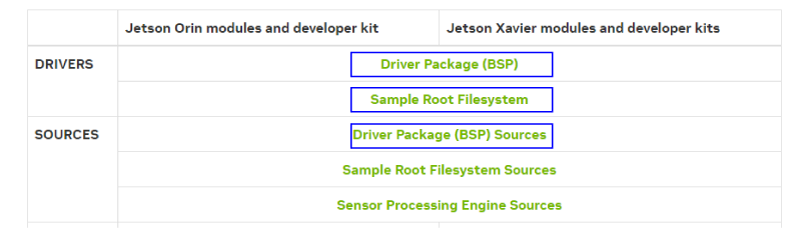

# Compiling L4T for the Xavier NX on the EchoPilot AI

## Instructions for customizing the device tree and compiling the kernel for the Xavier NX on EchoPilot AI

When a Jetson Xavier NX module is included with an EchoPilot AI purchase, it is flashed with a custom Linux for Tegra (L4T) image which includes support for the hardware configuration of the EchoPilot AI. The EchoPilot AI hardware provides provides nearly identical features of the Nvidia development kit board (PIf you wish to build/update the kernel for use with the EchoPilot AI, the instructions below will provide the information and files you need to ensure your custom image remains fully compatible with the EchoPilot AI hardware. When compared to a standard Nvidia development carrier board, the primary difference in the EchoPilot AI hardware are:

1. The EchoPilot AI does not have an I2C HDMI controller

To minimize console errors due to (1) which would otherwise be present, the kernel must be compiled from source and flashed to the Xavier NX using the Debug USB port and recovery mode. It is not possible to update only the dtb files because the pinmux changes require a full flash. The following instructions will walk you through the process.

!!! WARNING
    
    These instructions were developed and tested on Ubuntu 20.04 LTS (with a Windows machine used for the Excel pinmux change). We recommend using a *physical* machine running Ubuntu 20.04 LTS.

    These instructions assume you are using a _Production_ Jetson SOM. These instructions will not work with the SOM included with a Jetson developer kit. 
    
What you will doing:

1. Download and setup the necessary files
2. Replace .dtb and create a extlinux.conf file
3. Generate the image and flash the device

So buckle up and let's get started.

### Download and Setup Necessary Files

Note that you will need to create an NVIDIA developer account and login to download, so if you do not have a developer account please [set that up](https://developer.nvidia.com/login) before proceeding. 
Next you will need to download three packages from Nvidia: [Driver Package (BSP), Sample Root Filesystem and Driver Package (BSP) Sources](https://developer.nvidia.com/embedded/jetson-linux). 

> These instructions were developed using Jetson Linux 35.3.1. These instructions _may_ continue to work for future releases,   but proceed with caution.

The files to download are highlighted in blue below:


The instructions below assume that the downloaded files are downloaded to the `~/Downloads/` folder.  

#### Extract Driver Package (BSP)
> Note: the filename below will be different if you download a different version.

```
mkdir -p ~/XavierNX
tar xpf ~/Downloads/Jetson_Linux_R35.4.1_aarch64.tbz2 -C ~/XavierNX
```

#### Extract sample Root File System  (Sample Root Filesystem)
Extract contents into Linux_for_Tegra/rootfs/. Note the filename below will be different if you downloaded a different version.
```
sudo tar xpf ~/Downloads/Tegra_Linux_Sample-Root-Filesystem_R35.4.1_aarch64.tbz2 -C ~/XavierNX/Linux_for_Tegra/rootfs/
cd ~/XavierNX/Linux_for_Tegra
sudo ./apply_binaries.sh
```
!!! note
    Before “apply_binaries.sh” is run, the content in “Linux_for_Tegra/rootfs/” is purely Ubuntu. After “apply_binaries.sh” the “rootfs/” will contain NVIDIA content, e.g, drivers for the GPU and some firmware.

### Create the default user

This step allows you to configure your username, password and hostname and also accept the license.
```
sudo tools/l4t_create_default_user.sh -u {USERNAME} -p {PASSWORD} -a -n {HOSTNAME} --accept-license
```
    
### Get the EchoPilot .dtb and extlinux.conf files

The files you will need to replace include the device tree binary (.dtb) and extlinux.conf files. These files can be obtained from the repository [https://github.com/EchoMAV/echopilot_ai_bsp](https://github.com/EchoMAV/echopilot_ai_bsp). Use the steps below to clone and install these files:

Clone the files:
```
cd ~
git clone https://github.com/EchoMAV/echopilot_ai_bsp
cd echopilot_ai_bsp
```
Checkout the appropriate branch for your EchoPilot AI board revision. For example, EchoPilot AI rev1 hardware:
```
git checkout board_revision_1a
```
Run the install script to copy the dtb and extlinux.conf files into your Linux_for_Tegra folder. The usage is `./install_l4t_xavier_nx.sh [Path to Linux_for_Tegra]`, e.g.:
```
./install_l4t_xavier_nx.sh ~/XavierNX/Linux_for_Tegra/
```
Ensure this script completes with no errors before proceeding with flashing.

### Flash device
!!! important
    While not shown in the images below. The EchoPilot AI should be plugged into a Carrier Board for these steps, as that is how the Jetson module is powered. 
1. Plug in a micro usb cable to the Jetson Debug port (J25) on the EchoPilot AI. Refer to the image below for the Jetson Program / Debug connector on the left side.

2. Hold the recovery button down as power is applied. (see image below for location of the recovery button).

3. Apply power via the XT30 connector on the carrier board, and release recovery button after a few seconds.
4. From your host PC, flash the Xavier NX device:

```
cd ~/XavierNX/Linux_for_Tegra/
sudo ./flash.sh jetson-xavier-nx-devkit-emmc mmcblk0p1
```


