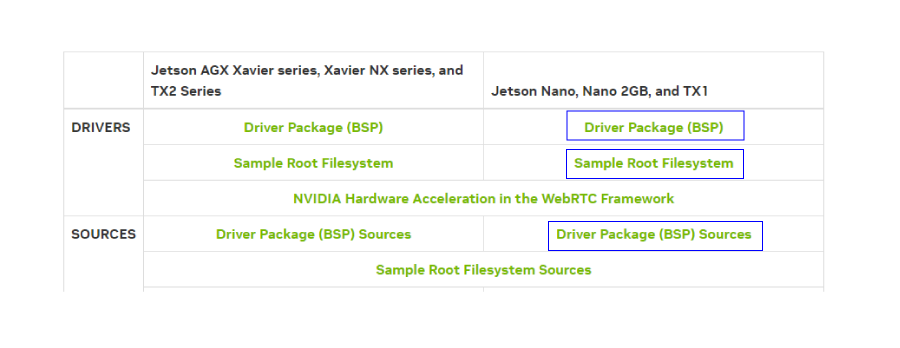

# Compiling L4T for the Jetson Nano on the EchoPilot AI

## Instructions for customizing the device tree and compiling the kernel for the Nano on EchoPilot AI

When a Jetson Nano module is included with an EchoPilot AI purchase, it is flashed with a custom Linux for Tegra (L4T) image which includes support for the hardware and pin configuration of the EchoPilot AI. If you wish to build/update the kernel for use with the EchoPilot AI, the instructions below will provide the information and files you need to ensure your custom image remains fully compatible with the EchoPilot AI hardware. When compared to a standard Nvidia development carrier board, the primary differences in the EchoPilot AI hardware are:

1. The EchoPilot AI does not have an I2C HDMI controller
2. The EchoPilot AI has an SD Card (SDMMC3)

To minimize console errors due to (1) and to enable the SD card on SDMMC3, the kernel must be compiled from source and flashed to the Nano using the Debug USB port and recovery mode. The following instructions will walk you through the process.

!!! WARNING
    
    These instructions were developed and tested on Ubuntu 20.04 LTS (with a Windows machine used for the Excel pinmux change). We recommend using a *physical* machine running Ubuntu 20.04 LTS.

    These instructions assume you are using a _Production_ Jetson Nano P3448_0002 SOM. These instructions will not work with the SOM included with a Jetson Nano developer kit. 
    
What you will doing:

1. Download and setup the necessary files
2. Replace .dtb and create a extlinux.conf file
3. Generate the image and flash the device

So buckle up and let's get started.

> _These instructions are adapted from the the excellent document by Ridge Run [How to build NVIDIA Jetson Nano kernel](https://developer.ridgerun.com/wiki/index.php/Jetson_Nano/Development/Building_the_Kernel_from_Source) along with documentation pulled from Nvidia's forums. Some minor changes are included from this document because the last update was for LT4 32.3.1.

Note that Nvidia has dropped software support for the Nano as it ends 

### Download and Setup Necessary Files

Note that you will need to create an NVIDIA developer account and login to download, so if you do not have a developer account please [set that up](https://developer.nvidia.com/login) before proceeding. 
Next you will need to download three packages from Nvidia: [Driver Package (BSP), Sample Root Filesystem and Driver Package (BSP) Sources](https://developer.nvidia.com/embedded/linux-tegra-r3273). 

> These instructions were developed using Jetson Linux 32.7.3, you **can not use** releases beyond 32.7.x as the Nano is no longer supported by Nvidia for newer software releases.

The files to download are highlighted in blue below:


!!! note
    The instructions below assume that the downloaded files are downloaded to the `~/Downloads/` folder.  

#### Extract Driver Package (BSP)
> Note: the filename below will be different if you download a different version.

```
mkdir -p ~/Nano
tar -xf ~/Downloads/Jetson_Linux_R32.7.3_aarch64.tbz2 -C ~/Nano
```
#### Extract kernel sources (Driver Package (BSP) Sources)
In the public_sources.tbz2 (BSP sources) zip file, there will be many other zipped files inside, but we are only interested in kernel_src.tbz2. Extract this file into a folder to named `sources` within the `Linux_for_Tegra` folder. The steps are:
```
mkdir ~/Downloads/temp
tar -xf ~/Downloads/public_sources.tbz2 -C ~/Downloads/temp
mkdir ~/Nano/Linux_for_Tegra/sources
sudo tar -xf ~/Downloads/temp/Linux_for_Tegra/source/public/kernel_src.tbz2 -C ~/Nano/Linux_for_Tegra/sources
cd ~/Nano/Linux_for_Tegra
sudo ./source_sync.sh -t tegra-l4t-r32.7.3
```
#### Extract sample Root File System  (Sample Root Filesystem)
Extract contents into Linux_for_Tegra/rootfs/. 
```
mkdir ~/Nano/Linux_for_Tegra/rootfs
sudo tar -xf ~/Downloads/Tegra_Linux_Sample-Root-Filesystem_R32.7.3_aarch64.tbz2 -C ~/Nano/Linux_for_Tegra/rootfs/
sudo ./apply_binaries.sh
```
!!! note
    Before “apply_binaries.sh” is run, the content in “Linux_for_Tegra/rootfs/” is purely Ubuntu. After “apply_binaries.sh” the “rootfs/” will contain NVIDIA content, e.g, drivers for the GPU and some firmware.

### Get the EchoPilot .dtb, .cfg and extlinux.conf files

The files you will need to replace include the device tree binary (.dtb) and extlinux.conf files. These files can be obtained from the echopilot_ai_bsp repository [https://github.com/EchoMAV/echopilot_ai_bsp](https://github.com/EchoMAV/echopilot_ai_bsp). Use the steps below to clone and install these files:

Clone the files:
```
cd ~
git clone https://github.com/EchoMAV/echopilot_ai_bsp
cd echopilot_ai_bsp
```
Checkout the appropriate branch for your EchoPilot AI board revision. For example, EchoPilot AI rev0 hardware:
```
git checkout board_revision_0
```
Run the install script to copy the dtb and extlinux.conf files into your Linux_for_Tegra folder. The usage is `./install_l4t_nano.sh [Path to Linux_for_Tegra]`, e.g.:
```
sudo ./install_l4t_nano.sh ~/Nano/Linux_for_Tegra/
```
Ensure this script completes with no errors before proceeding with flashing.

### Flash device
!!! important
    While not shown in the images below. The EchoPilot AI should be plugged into a Carrier Board for these steps, as that is how the Jetson module is powered. 
1. Plug in a usb cable (this will require a JST-GH to micro usb female adapter for Rev0 boards) to the Jetson Debug port (J25) on the EchoPilot AI. Rev 0 is shown below to help you locate this connector. Note: future versions of hardware may use a USB micro connector for J25 rather than a JST-GH connector.

2. Hold the recovery button down. (see image below for location of the recovery button).

3. Apply power, and release recovery button after a few seconds.
4. Flash device:

```
cd ~/Nanogit/Linux_for_Tegra/
sudo ./flash.sh jetson-nano-emmc mmcblk0p1
```


