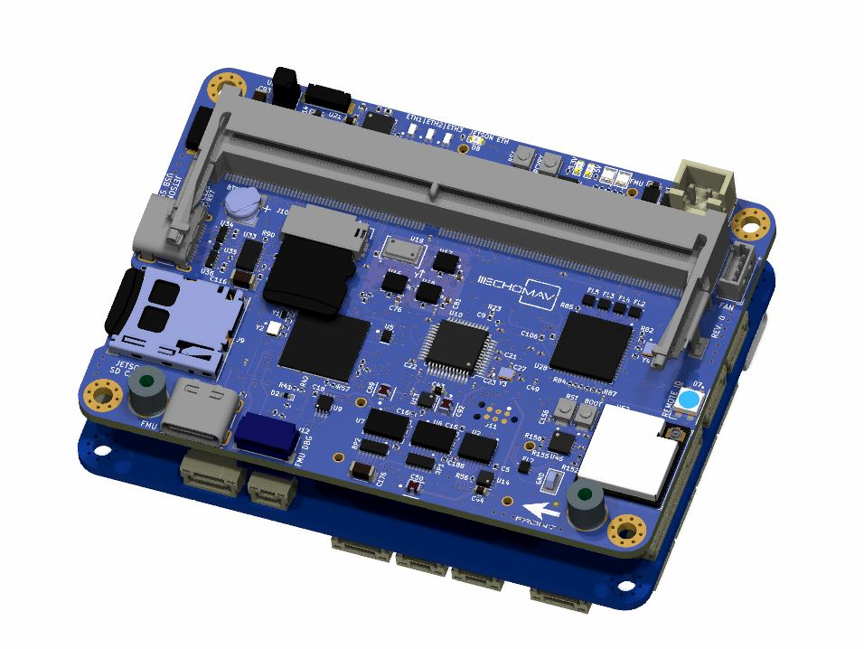
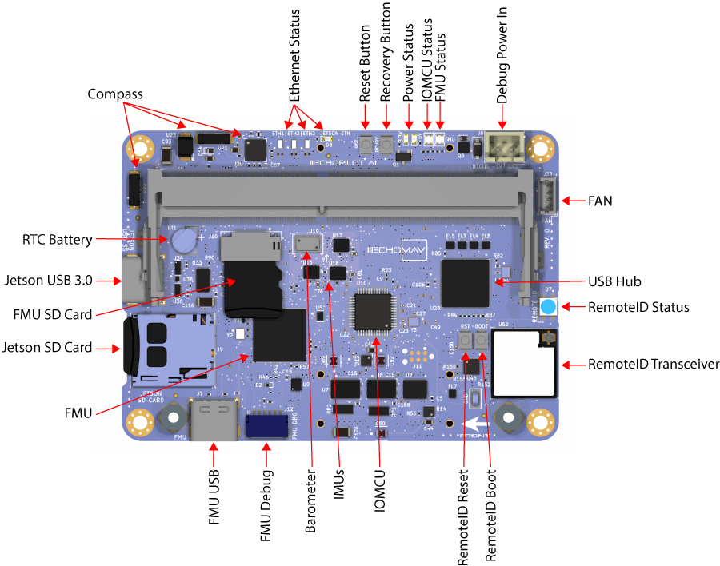

# EchoPilot AI Documentation

## Overview

The EchoPilot AI is a highly integrated vehicle control and edge computing system designed to power next-generation uncrewed systems. The EchoPilot AI supports computer vision, machine learning, autonomy, artificial intelligence and other advanced edge computing needs. The EchoPilot AI leverages the popular Ardupilot and PX4 projects, and uses Pixhawk open-hardware standards. The power of  an advanced autopilot is seamlessly combined with high-performance computing, IP networking, cloud connectivity and flexible low-latency hardware accelerated video encoding.



The hardware is configured into a two board stack. The upper board is the EchoPilot AI board, and it contains the flight management unit, peripherals, sensors and Nvidia Jetson interface. The lower board is the Carrier Board, and it handles power regulation and connectors. Two high-density FX23L-80S-0.5SV 80-pin board-to-board connectors are used between the two boards.

This design philosophy achieves multiple goals:

1. For integrated vehicle solutions, it is often desired to design a custom carrier board to add additional components, minimize cables/wiring, integrate power distribution. In this case, our design allows you to design a carrier board (using the provided Carrier Board as a reference design) and in production products use only the EchoPilot AI board.
2. A stacked solution minimizes X-Y size in exchance for moving into the Z axis, which is an acceptable compromise for most uncrewed vehicles.
3. Moving the switching power regulators to the Carrier board reduced noise near the sensitive sensors on EchoPilot AI board.
4. A stacked design is more future proof, as periperals can often be added to the Carrier Board without a re-design of the EchoPilot AI main board.

## Quickstart Guide

### Accessing the Jetson via the console

These instructions assume you have a Jetson module that is already flashed. If you have a new Jetson module that is not flashed, please see [Flashing a Jetson](#flashing-a-jetson-module-using-the-echopilot-ai) instructions.
> **WARNING**: Do not run the Jetson SOM without a heatsink. The module may be damaged or performance throttled. See connecttech.com for recommended active and passive heatsinks.

1. Assemble the EchoPilot AI board with a Carrier Board, using 8mm standoffs between the two boards.
2. If a Jetson Module is not already installed in the EchoPilot AI, install the module now.
3. Attached a USB cable between your host computer and J7 (Console) on the Carrier Board
4. In step 3, your host computer should have enumerated a virtual comm port. You will now need to find the name of the port.
> **On Windows:** Open Device Manager (Start → Control Panel → Hardware and Sound → Device Manager) Look in the Device Manager list, open the category "Ports", and note the COM port added **USB Serial Port (COM?)** (e.g., COM10).  
> **On Linux:** Run ```dmesg -w``` and then plug in unplug and replug in the USB cable. You should see the name of the device added, typically ```FTDI USB Serial device converter now attached to ttyUSB?``` (e.g., ttyUSB0). 
5. Use a terminal program to connect to the Jetson's console at 115200 baud, 8N1. 
>**On Windows:** We recommend [Putty](https://www.putty.org/) or [TeraTerm](https://osdn.net/projects/ttssh2/releases/).  
>**On Linux:** We recommend Picocom. Install with ```sudo apt-get install picocom```. Use with ```picocom /dev/ttyUSB? -b 115200```. To exit picocom, use ```Ctrl-a Ctrl-x```.
6. Power the Carrier Board with 7-56VDC source capable of supplying up to 4A.
7. You should now see the boot messages in your console, and once complete you will see a login prompt.
> The default username is **echopilot** and the default password is **echopilot**
8. At this point you are logged into the Jetson and can begin configuring the network, installing applications, etc.
 
### Connecting to the FMU via the USB connector

1. Attach a USB cable between the host computer and the **FMU USB** connector (J7).
2. Start a ground control application on the host computer such as [QGroundControl](https://docs.qgroundcontrol.com/master/en/getting_started/download_and_install.html) or [Mission Planner](https://ardupilot.org/planner/docs/mission-planner-installation.html).
> **QGroundControl:** Will automatically connect.  
> **Mission Planner:** Select the appropriate COM port at the top right, 115200, then click CONNECT.

## Board Components and Connectors

### Top Side EchoPilot AI



### Bottom Side EchoPilot AI


### Pinouts EchoPilot AI

#### Debug Power In (J8)
This connector is **not normally used**. It exists only to power the EchoPilot AI without a carrier board attached.

Connector: J8, Part Number: B2B-XH-A(LF)(SN)  
Mating Connector: XHP-2

Pin Number   | Direction     | Voltage       | Pin Description
------------ | ------------- | ------------  | ------------
PIN 1        | Pwr            | GND           | Ground
PIN 2        | Pwr            | +5.2V          | Debug Power Input

#### FMU Debug (J12)
This connector is **not normally used** by the customer. It is primarily used during board setup to load bootloader firmware on the FMU. It is however possible to use the UART7 lines for other purposes.

Connector: J12, Part Number: SM06B-SRSS-TB(LF)(SN)  
Mating Connector: SHR-06V-S-B

Pin Number   | Direction     | Voltage       | Pin Description
------------ | ------------- | ------------  | ------------
PIN 1        | Pwr            | +3.3V           | 3.3V Power
PIN 2        | O            | +3.3V          | FMU UART7 TX
PIN 3        | I            | +3.3V          | FMU UART7 RX
PIN 4        | IO            | +3.3V         | FMU SWDIO
PIN 5        | O            | +3.3V          | FMU SWCLK
PIN 6        | Pwr           | GND          | Gnd

#### IO Debug (J13)
This connector is **not normally used** by the customer. It is used during board setup to load bootloader firmware on the IOMCU.

Connector: J13, Part Number: SM06B-SRSS-TB(LF)(SN)  
Mating Connector: SHR-06V-S-B

Pin Number   | Direction     | Voltage       | Pin Description
------------ | ------------- | ------------  | ------------
PIN 1        | Pwr            | +3.3V           | 3.3V Power
PIN 2        | O            | +3.3V          | IOMCU UART1 TX
PIN 3        | I            | +3.3V          | IOMCU UART1 RX
PIN 4        | IO            | +3.3V         | IOMCU SWDIO
PIN 5        | O            | +3.3V          | IOMCU SWCLK
PIN 6        | Pwr           | GND          | Gnd

#### Jetson Debug (J25)
This connector is used to flash new firmward to the Jetson SOM.

Connector: J25, Part Number: SM04B-GHS-TB(LF)(SN)
Mating Connector: GHR-04V-S

Pin Number   | Direction     | Voltage       | Pin Description
------------ | ------------- | ------------  | ------------
PIN 1        | Pwr            | +5.0V           | VBus Detect
PIN 2        | D-            | Diff Signal          | USB D-
PIN 3        | D+            | Diff Signal          | USB D+
PIN 4        | Pwr            | GND         | Gnd


### Top Side Carrier Board

### Bottom Side Carrier Board

### Pinouts Carrier Board

## Mechanical

TBD Step Files
TBD Location of Screw Holes

## Notes on Vibration Isolation

TBD

## Building and Loading ArduPilot Firmware

```
TBD
```

## Building and Loading PX4 Firmware

As of PX4 1.13.3, the EchoPilot AI hardware definition files are not yet pulled into the [PX4 repository](https://github.com/PX4/PX4-Autopilot). Therefore, if you wish to use PX4 firmware on the EchoPilot AI, you will need to follow the steps below and build PX4 from source. Fortunately the process is straightforward:

### Prerequisites
These instructions were tested on Ubuntu 20.04 LTS. They are not guranteed to work on any other flavor of Linux, within a vitual machine or under WSL 1 or 2. We recommend a **physical machine** running Ubuntu 20.04 LTS for the most pain-free experience.

### Download PX4 
These instructions will install PX4 in ```~/PX4-Autopilot```. If you wish to use a diffent location, please adjust the directory below and thoughout these instructions. If you are a novice, we recommend proceeding exactly as described below.
```
cd ~
git clone https://github.com/PX4/PX4-Autopilot.git --recursive
cd PX4-Autopilot
```
### Setup the toolchain
Note if you have built PX4 before, you can likely skip this step. Also remove the ```--no-sim-tools``` option if you wish to install the simulation toolchain.
```
bash ./Tools/setup/ubuntu.sh --no-sim-tools
```
### Checkout a release
You can identify a version you wish to build by looking at the release history https://github.com/PX4/PX4-Autopilot/releases. In the example below, we will demonstrate checking out release 1.13  
> **_NOTE:_**  You can reuse an existing repo rather than cloning a new one if this isn't your first PX4 rodeo. In this case, clean the build environment before proceeding:
> ```
> make clean
> make distclean
> ```
```
git fetch origin release/1.13
git checkout release/1.13
```
Update submodules:
```
make submodulesclean
```
### Do a test build
Before we build firmware for the EchoPilot AI board, it is wise to first build a native target to verify that your toolchain and environment is setup and working. Build the px4_sitl (software in the loop simulator) first:
```
make px4_sitl
```
If the build completes without errors, congrats! If there are errors, you will need to resolve them before proceeding.
### Build PX4 for the EchoPilot AI
First obtain the hardware board files:
> **Note:** If you are using a Rev. 0 board, use the instructions below. For later revisions, replace **rev0** in the filenames below with the appropriate board revision (e.g., rev1). The revision number is shown on the top side of the board near the FAN connector.

```
cd /tmp
wget https://echomav.com/px4/echopilot_px4_rev0.tar.gz
```
Extract files from the archive into the ```~/PX4-Autopilot/boards``` folder
```
tar -xvf echopilot_px4.rev0.tar.gz -C ~/PX4-Autopilot/boards/
cd ~/PX4-Autopilot
```

At this point, you should have the hardware files located in ```~/Px4-Autopilot/boards/echomav/echopilot-ai/```. To build firmware targeting this board, use the command:
```
make echomav_echopilot-ai
```
The .px4 file will be located in the ```~/PX4-Autopilot/build/echomav_echopilot-ai_default/``` folder. The firmware is now ready to be loaded on the board.  
> **_NOTE:_** If the EchoPilot AI is plugged in to your host computer, unplug it before proceeding. The board should be totally powered off before proceeding.
```
make echomav_echopilot-ai upload
```
When the build completes, the system will wait for a USB connection from the EchoPilot AI's bootloader. You should see a message indicating ```waiting for the bootloader...```. At this point, plug in a USB-A to USB-C cable between the host computer and the **FMU** USB connection on the EchoPilot AI. The board should be recognized and the firmware will be uploaded automatically.
> Optionally, you can use [QGroundControl](https://docs.qgroundcontrol.com/master/en/getting_started/download_and_install.html) to upload the ```~/PX4-Autopilot/build/echomav_echopilot-ai_default/echomav_echopilot-ai_default.px4``` file created previously. This is especially useful if you wish to send a firmware update to a customer as they can do it without terminal access. Follow the steps here to upload **Custom Firmware** using QGroundControl: [https://docs.px4.io/main/en/config/firmware.html](https://docs.px4.io/main/en/config/firmware.html)

## Flashing a Jetson Module using the EchoPilot AI

The EchoPilot AI hardware is nearly identical to an Nvidia developer kit, meaning it is possible to load firmware using NVidia's [SDK Manager](https://developer.nvidia.com/sdk-manager) using one of the standard configurations (e.g. see this [link](https://docs.nvidia.com/jetson/archives/r34.1/DeveloperGuide/text/IN/QuickStart.html#jetson-modules-and-configurations) for Xavier NX and Orin). The one caveat is that the EchoPilot AI is headless and does not have a HDMI controller chip. Because of this, when using a standard build with a device tree designed for the developer kit, you may get occasional error messages output to the serial console.  

To flash firmware using NVidia's SDK Manager:  

1. Ensure the EchoPilot AI is powered off.  
2. Attach a JST-GH to USB adapter (Rev0, included with the EchoPilot AI) or common USB to USB Micro-b cable (Rev1+) to the Jetson Debug port ([J25](#jetson-debug-j25)) and plug in the USB to your host computer.  
3. While holding down the **Recovery** button, apply power to the EchoPilot AI. Release after 5 seconds.
4. The Jetson module will start in recovery mode, allowing you to proceed to load firmware using the SDK Manager.  

### Advanced Jetson Flashing

As mentioned above, flashing a standard image may cause HDMI errors in the serial console. To remove these warnings, it is necessary to build Linux4Tegra (L4T) from source and update the dts files to disable the hdmi subsystem. The instructions for doing so are below:

```
Instructions Coming Soon
```