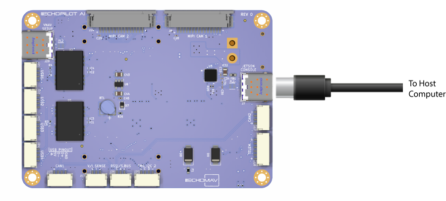
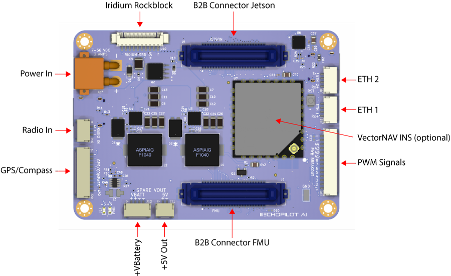
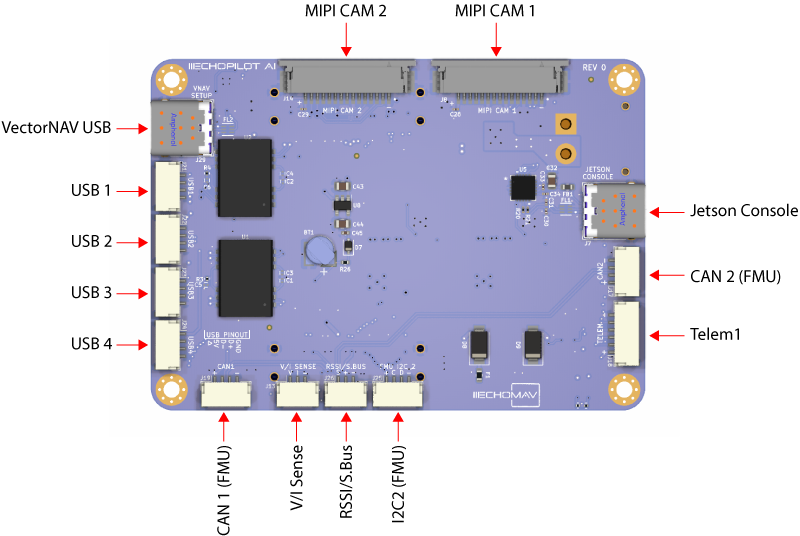

# EchoPilot AI Documentation

## Overview

The EchoPilot AI is a highly integrated vehicle control and edge computing system designed to power next-generation uncrewed systems. The EchoPilot AI supports computer vision, machine learning, autonomy, artificial intelligence and other advanced edge computing needs. The EchoPilot AI implements a STM32H7-based autopilot compatible with the popular Ardupilot and PX4 projects, and uses Pixhawk [open-hardware connectivity standards](https://github.com/pixhawk/Pixhawk-Standards/blob/master/DS-009%20Pixhawk%20Connector%20Standard.pdf). 

The power of  an advanced autopilot is seamlessly combined with high-performance computing (including AI and machine learning), IP networking, cloud connectivity and flexible low-latency hardware accelerated video encoding.


Autopilot Sensors
=== "Rev 0"

    Function   | Part Number
    ------------ | ------------- 
    IMU 1        | ICM42688P            
    IMU 2        | ICM42688P            
    IMU 3        | ICM42688P      
    Barometer 1        | MS5611                  
    Magentometer        | PNI RM3100    
    Add-On INS      | VectorNAV VN-X00 (optional)        

=== "Rev 1"

     Function   | Part Number
    ------------ | ------------- 
    IMU 1        | ICM42688P            
    IMU 2        | ICM42688P            
    IMU 3        | ICM42688P      
    Barometer 1        | ICP-20100                  
    Barometer 2        | ICP-20100 
    Magentometer        | PNI RM3100    
    Add-On INS      | VectorNAV VN-X00 (optional)        

The hardware is configured into a two board stack. The upper board is the EchoPilot AI board, and it contains the flight management unit, peripherals, sensors and Nvidia Jetson interface. The lower board is the Carrier Board, and it handles power regulation and connectors. Two high-density FX23L-80S-0.5SV 80-pin board-to-board connectors are used between the two boards.

This design philosophy achieves multiple goals:

1. For integrated vehicle solutions, it is often desired to design a custom carrier board to add additional components, minimize cables/wiring and integrate power distribution. The EchoPilot AI's design allows you to optionally design a custom carrier board (using the provided Carrier Board as a [reference design](https://github.com/EchoMAV/echopilot_ai_carrier)).
2. A stacked solution minimizes X-Y size in exchange for moving into the Z axis, which is an acceptable compromise for most uncrewed vehicles.
3. Moving the switching power regulators to the Carrier board reduces noise near the sensitive sensors on EchoPilot AI board and reduces the thermal load of the EchoPilot AI mainboard.
4. A stacked design is more future proof, as peripherals can often be added to the Carrier Board without a re-design of the EchoPilot AI main board.

## Quick Start Guide

### Accessing the Jetson via the console

These instructions assume you have a Jetson module that is already flashed. If you have a new Jetson module that is not flashed, please see [Flashing a Jetson](#flashing-a-jetson-module-using-the-echopilot-ai) instructions.

!!! WARNING

    Do not run the Jetson SOM without a heatsink. The module may be damaged or performance throttled. See [connecttech.com](http://connecttech.com) for recommended active and passive heatsinks.

1. Assemble the EchoPilot AI board with a Carrier Board, using 8mm standoffs between the two boards.
2. If a Jetson Module is not already installed in the EchoPilot AI, install the module now.
3. Attached a USB cable between your host computer and J7 (Console) on the Carrier Board

4. In step 3, your host computer should have enumerated a virtual comm port. You will now need to find the name of the port.
!!! info
    **On Windows:** Open Device Manager (Start → Control Panel → Hardware and Sound → Device Manager) Look in the Device Manager list, open the category "Ports", and note the COM port added **USB Serial Port (COM?)** (e.g., COM10).  
    **On Linux:** Run ```dmesg -w``` and then plug in unplug and replug in the USB cable. You should see the name of the device added, typically ```FTDI USB Serial device converter now attached to ttyUSB?``` (e.g., ttyUSB0). 
Use a terminal program to connect to the Jetson's console at 115200 baud, 8N1. 
!!! info
    **On Windows:** We recommend [Putty](https://www.putty.org/) or [TeraTerm](https://osdn.net/projects/ttssh2/releases/).  
    **On Linux:** We recommend Picocom. Install with ```sudo apt-get install picocom```. Use with ```picocom /dev/ttyUSB? -b 115200```. To exit picocom, use ```Ctrl-a Ctrl-x```.
Power the Carrier Board with 7-56VDC source capable of supplying up to **4A**.
!!! warning
    If using a bench supply with over-current protection, we recommend turning it **OFF**. The boot process requires short bursts of high current and over-current protection on some supplies will result in a failed boot.
You should now see the boot messages in your console, and once boot is complete, you will see a login prompt.
!!! note
    The default username is **echopilot** and the default password is **echopilot**
!!! success
    At this point you are logged into the Jetson and can begin [configuring the network](#configure-the-network), installing applications, etc.
 
### Connecting to the FMU via the USB connector

1. Attach a USB cable between the host computer and the **FMU USB** connector (J7).
2. Start a ground control application on the host computer such as [QGroundControl](https://docs.qgroundcontrol.com/master/en/getting_started/download_and_install.html) or [Mission Planner](https://ardupilot.org/planner/docs/mission-planner-installation.html).
!!! info
    **QGroundControl:** Will automatically connect.  
    **Mission Planner:** Select the appropriate COM port at the top right, 115200, then click CONNECT.

## Board Components and Connectors

### EchoPilot AI


### Carrier Board





### Pinouts

For EchoPilot AI Pinouts, refer to the [EchoPilot AI Pinout Page](echopilot_ai_pinout.md).  

For Carrier Board Pinouts, refer to the [Carrier Board Pinout Page](echopilot_carrier_pinout.md).

## Mechanical STEP Files

[EchoPilot AI 3D Model (STEP) File Download](https://echomav.com/mechanical/echopilot_ai_r0.step)

[EchoPilot AI Universal Carrier Board 3D model (STEP) File Download](https://echomav.com/mechanical/echopilot_ai_carrier_r0.step)

[EchoPilot AI PWM Breakout Board 3D model (STEP) File Download](https://echomav.com/mechanical/echopilot_pwm_breakout.step)

## Notes on Vibration Isolation

Many commercial autopilots use foam vibration isolation on a daughterboard containing the IMUs. You'll notice the EchoPilot AI does not use this type of design and the IMUs are mounted directly to the circuit board. The reason for this is that we feel better vibration isolation can be achieved (if required) by leveraging the mass of the entire EchoPilot system (carrier board, main board and Jetson SOM) rather than the very small mass of an IMU daughterboard. For the types of vibrations encountered by large-prop multi-rotors and piston-based engines (50-90 Hz), the total mass of the EchoPilot system mounted on vibration silicone isolators or wire rope isolators are very effective. This design has the added benefits of protecting critical electronics from exposure to continuous vibrations.  

!!! note
    Note that for small and medium multi-rotors and electric planes, electric quadplanes and other vehicle types, vibration isolation is very rarely needed. 

## Using the SD Card

The SD card supports hot-plugging. When connected, `/dev/mmcblk1p1` should be found by the operating system. To mount this drive to a directory (e.g., `/sdcard`) use the following command:
```
mkdir /sdcard
sudo mount /dev/mmcblk1p1 /sdcard
```
To unmount it:
```
sudo umount /dev/mmcblk1p1 /sdcard
```

## Configure the Network

Linux for Tegra uses networkmanager (`nmcli`) for its network interfaces. Below you will find a few commands for common network tasks.

Show connections:    
```nmcli con show```

Delete the default connection ("Wired connection 1") and set up a static connection called `static-eth0` with an IP of 172.20.1.100, a netmask of 255.255.0.0 and a gateway of 172.20.2.100:    
```
sudo nmcli c delete "Wired connection 1"
sudo nmcli c add con-name static-eth0 ifname eth0 type ethernet ip4 172.20.1.20/16 gw4 172.20.2.100
sudo nmcli c up static-eth0
```

Change IP address of `static-eth0` connection to `192.168.1.4/16`:    
```
sudo nmcli con mod static-eth0 ipv4.address 192.168.1.1/16
```

Change gateway of `static-eth0` connection to `192.168.1.1`:    
```
sudo nmcli con mod static-eth0 ipv4.gateway 192.168.1.1
```

Change dns of `static-eth0` connection to `8.8.8.8`:       
```
sudo nmcli con mod static-eth0 ipv4.dns "8.8.8.8"
```

Take down/up of `static-eth0`:      
```
sudo nmcli con down static-eth0
sudo nmcli con up static-eth0
```
Delete `static-eth0` connection:    
```
sudo nmcli c delete "static-eth0"
```

Add new connection called `static-eth0` with IP `172.20.2.22/16` and gateway `172.20.2.100`:    
```
sudo nmcli c add con-name static-eth0 ifname eth0 type ethernet ip4 172.20.2.22/16 gw4 172.20.2.100
```

Add a persistent route so that multicast traffic to 224.x.x.x goes to the `static-eth0` connection:  
```
sudo nmcli con mod static-eth0 +ipv4.routes "224.0.0.0/8"
```

Change eth0 to enable remove static IP and enable DHCP (In this case, it would make more sense to delete the connection since it is named `static-eth0` and call it something else, but for edification:
```
sudo nmcli con mod static-eth0 ipv4.address ""
sudo nmcli con mod static-eth0 ipv4.method auto
sudo nmcli con down static-eth0
sudo nmcli con up static-eth0
```

## Interfacing the Jetson to the Autopilot

The autopilot has a high-speed serial interface between the STM32H7 and the Jetson SOM. The Jetson UART1 (pins 203, 205) are connected to the autopilot's USART3 (Typically Telem2). To enable [MAVLink](https://mavlink.io/en/) data, you will need to check and/or modify PX4/Ardupilot parameters to ensure that Telem2 is set to MAVLink and set the baud rate to the desired value. A typical baud rate is 500,000 but you can use any baud rate you wish as long as the application receiving MAVLink on the Jetson is configured to match. 

On the Jetson side, UART1 is typically ```/dev/ttyTHS2```.

There are many options available for MAVLink routing and handling. One typical application is routing the MAVLink data over a network - and [MAVLink Router](https://github.com/mavlink-router/mavlink-router) is a popular open-source solution. To use MAVLink Router to route MAVLink packets from UART1 (/dev/ttyTHS2) to a UDP endpoint (192.168.1.10:14550) on the network, use the following command:

```
$ mavlink-routerd -e 192.168.1.10:14550 /dev/ttyTHS2:5000000
```

If you have issues accessing `/dev/ttyTHSX`, please disable `nvgetty` and ensure you are a member of the `dialout` group:
```
sudo systemctl stop nvgetty
sudo systemctl disable nvgetty
sudo usermod -aG dialout $USER
```
!!! note
    Reboot to apply changes.

## Remote ID Subsystem

The Remote ID system is based on an ESP32-C3 and is designed to work with the [ArduRemoteID](https://github.com/ArduPilot/ArduRemoteID) project and Open Drone ID standards.

ArduRemoteID is is an implementation of a MAVLink and DroneCAN OpenDroneID transmitter. It aims to provide a transmitter solution for the FAA standard RemoteID requirement, meeting the transmitter component of the ASTM F3586-22 Means of Compliance. It also aims to be compliant with the RemoteID regulation in the EU.

It is the responsibility of the user to configure the ArduRemoteID firmware in a way that it is compliant with the local RemoteID regulation. For instance, in the USA it is mandatory that UAV manufacturers submit a DoC (Declaration of Conformance) to the FAA where they state that their product is compliant with the RemoteID regulation.

To flash ArduRemote ID to the ESPS32-C3, you will need a TC2030-USB-NL cable from [tag-connect.com](https://www.tag-connect.com) and follow the flashing instructions from the [AruRemoteID](https://github.com/ArduPilot/ArduRemoteID#flashing) project.

To configure the Remote ID system, parameters can be accessed from DroneCAN (via Mission Planner or DroneCAN GUI) or with MAVLink. To use DroneCAN, [SLCAN will need to be enabled](https://ardupilot.org/copter/docs/common-slcan-f7h7.html#common-slcan-f7h7) to allow the autopilot to connect to the CANBUS through USB.  

For making changes to DroneCAN devices, see the instructions [here].(https://ardupilot.org/copter/docs/common-slcan-f7h7.html#making-changes-to-dronecan-devices)