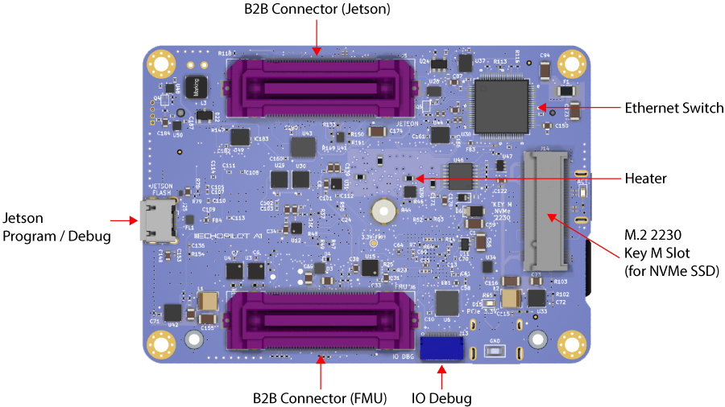

# EchoPilot AI Documentation

## Overview

The EchoPilot AI is a highly integrated vehicle control and edge computing system designed to power next-generation uncrewed systems. The EchoPilot AI supports computer vision, machine learning, autonomy, artificial intelligence and other advanced edge computing needs. The EchoPilot AI implements a STM32H7-based autopilot compatible with the popular Ardupilot and PX4 projects, and uses Pixhawk [open-hardware connectivity standards](https://github.com/pixhawk/Pixhawk-Standards/blob/master/DS-009%20Pixhawk%20Connector%20Standard.pdf). 

The power of  an advanced autopilot is seamlessly combined with high-performance computing (including AI and machine learning), IP networking, cloud connectivity and flexible low-latency hardware accelerated video encoding.


The hardware is configured into a two board stack. The upper board is the EchoPilot AI board, and it contains the flight management unit, peripherals, sensors and Nvidia Jetson interface. The lower board is the Carrier Board, and it handles power regulation and connectors. Two high-density FX23L-80S-0.5SV 80-pin board-to-board connectors are used between the two boards.

This design philosophy achieves multiple goals:

1. For integrated vehicle solutions, it is often desired to design a custom carrier board to add additional components, minimize cables/wiring and integrate power distribution. The EchoPilot AI's design allows you to optionally design a custom carrier board (using the provided Carrier Board as a [reference design](https://github.com/EchoMAV/echopilot_ai_carrier)).
2. A stacked solution minimizes X-Y size in exchange for moving into the Z axis, which is an acceptable compromise for most uncrewed vehicles.
3. Moving the switching power regulators to the Carrier board reduces noise near the sensitive sensors on EchoPilot AI board and reduces the thermal load of the EchoPilot AI mainboard.
4. A stacked design is more future proof, as peripherals can often be added to the Carrier Board without a re-design of the EchoPilot AI main board.

## Quick Start Guide

### Accessing the Jetson via the console

These instructions assume you have a Jetson module that is already flashed. If you have a new Jetson module that is not flashed, please see [Flashing a Jetson](#flashing-a-jetson-module-using-the-echopilot-ai) instructions.

!!! WARNING

    Do not run the Jetson SOM without a heatsink. The module may be damaged or performance throttled. See [connecttech.com](http://connecttech.com) for recommended active and passive heatsinks.

1. Assemble the EchoPilot AI board with a Carrier Board, using 8mm standoffs between the two boards.
2. If a Jetson Module is not already installed in the EchoPilot AI, install the module now.
3. Attached a USB cable between your host computer and J7 (Console) on the Carrier Board
4. In step 3, your host computer should have enumerated a virtual comm port. You will now need to find the name of the port.
> **On Windows:** Open Device Manager (Start → Control Panel → Hardware and Sound → Device Manager) Look in the Device Manager list, open the category "Ports", and note the COM port added **USB Serial Port (COM?)** (e.g., COM10).  
> **On Linux:** Run ```dmesg -w``` and then plug in unplug and replug in the USB cable. You should see the name of the device added, typically ```FTDI USB Serial device converter now attached to ttyUSB?``` (e.g., ttyUSB0). 
5. Use a terminal program to connect to the Jetson's console at 115200 baud, 8N1. 
>**On Windows:** We recommend [Putty](https://www.putty.org/) or [TeraTerm](https://osdn.net/projects/ttssh2/releases/).  
>**On Linux:** We recommend Picocom. Install with ```sudo apt-get install picocom```. Use with ```picocom /dev/ttyUSB? -b 115200```. To exit picocom, use ```Ctrl-a Ctrl-x```.
6. Power the Carrier Board with 7-56VDC source capable of supplying up to 4A.
7. You should now see the boot messages in your console, and once boot is complete, you will see a login prompt.
> **IMPORTANT!:** The default username is **echopilot** and the default password is **echopilot**
8. At this point you are logged into the Jetson and can begin configuring the network, installing applications, etc.
 
### Connecting to the FMU via the USB connector

1. Attach a USB cable between the host computer and the **FMU USB** connector (J7).
2. Start a ground control application on the host computer such as [QGroundControl](https://docs.qgroundcontrol.com/master/en/getting_started/download_and_install.html) or [Mission Planner](https://ardupilot.org/planner/docs/mission-planner-installation.html).
> **QGroundControl:** Will automatically connect.  
> **Mission Planner:** Select the appropriate COM port at the top right, 115200, then click CONNECT.

## Board Components and Connectors

### Top Side EchoPilot AI


### Bottom Side EchoPilot AI



### Pinouts EchoPilot AI

#### Debug Power In (J8)
This connector is **not normally used**. It exists only to power the EchoPilot AI without a carrier board attached.

Connector: J8, Part Number: B2B-XH-A(LF)(SN)  
Mating Connector: XHP-2

Pin Number   | Direction     | Voltage       | Pin Description
------------ | ------------- | ------------  | ------------
PIN 1        | Pwr            | GND           | Ground
PIN 2        | Pwr            | +5.2V          | Debug Power Input

#### FMU Debug (J12)
This connector is **not normally used** by the customer. It is primarily used during board setup to load bootloader firmware on the FMU. It is however possible to use the UART7 lines for other purposes.

Connector: J12, Part Number: SM06B-SRSS-TB(LF)(SN)  
Mating Connector: SHR-06V-S-B

Pin Number   | Direction     | Voltage       | Pin Description
------------ | ------------- | ------------  | ------------
PIN 1        | Pwr            | +3.3V           | 3.3V Power
PIN 2        | O            | +3.3V          | FMU UART7 TX
PIN 3        | I            | +3.3V          | FMU UART7 RX
PIN 4        | IO            | +3.3V         | FMU SWDIO
PIN 5        | O            | +3.3V          | FMU SWCLK
PIN 6        | Pwr           | GND          | Gnd

#### IO Debug (J13)
This connector is **not normally used** by the customer. It is used during board setup to load bootloader firmware on the IOMCU.

Connector: J13, Part Number: SM06B-SRSS-TB(LF)(SN)  
Mating Connector: SHR-06V-S-B

Pin Number   | Direction     | Voltage       | Pin Description
------------ | ------------- | ------------  | ------------
PIN 1        | Pwr            | +3.3V           | 3.3V Power
PIN 2        | O            | +3.3V          | IOMCU UART1 TX
PIN 3        | I            | +3.3V          | IOMCU UART1 RX
PIN 4        | IO            | +3.3V         | IOMCU SWDIO
PIN 5        | O            | +3.3V          | IOMCU SWCLK
PIN 6        | Pwr           | GND          | Gnd

#### Jetson Debug (J25)
This connector is used to flash new firmware to the Jetson SOM.

Connector: J25, Part Number: SM04B-GHS-TB(LF)(SN)
Mating Connector: GHR-04V-S

Pin Number   | Direction     | Voltage       | Pin Description
------------ | ------------- | ------------  | ------------
PIN 1        | Pwr            | +5.0V           | VBus Detect
PIN 2        | D-            | Diff Signal          | USB D-
PIN 3        | D+            | Diff Signal          | USB D+
PIN 4        | Pwr            | GND         | Gnd


### Top Side Carrier Board

### Bottom Side Carrier Board

### Pinouts Carrier Board

## Mechanical

TBD Step Files
TBD Location of Screw Holes

## Notes on Vibration Isolation

TBD

## Interfacing the Jetson to the Autopilot

The autopilot has a high-speed serial interface between the STM32H7 and the Jetson SOM. The Jetson UART1 (pins 203, 205) are connected to the autopilot's USART3 (Typically Telem2). To enable [MAVLink](https://mavlink.io/en/) data, you will need to check and/or modify PX4/Ardupilot parameters to ensure that Telem2 is set to MAVLink and set the baud rate to the desired value. A typical baud rate is 500,000 but you can use any baud rate you wish as long as the application receiving MAVLink on the Jetson is configured to match. 

On the Jetson side, UART1 is typically ```/dev/ttyTHS2```.

There are many options available for MAVLink routing and handling. One typical application is routing the MAVLink data over a network - and [MAVLink Router](https://github.com/mavlink-router/mavlink-router) is a popular open-source solution. To use MAVLink Router to route MAVLink packets from UART1 (/dev/ttyTHS2) to a UDP endpoint (192.168.1.10:14550) on the network, use the following command:

```
$ mavlink-routerd -e 192.168.1.10:14550 /dev/ttyTHS2:5000000
```
