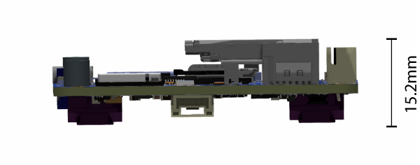

# EchoPilot AI Documentation

## Overview

The EchoPilot AI is a highly integrated vehicle control and edge computing system designed to power next-generation uncrewed systems. The EchoPilot AI supports computer vision, machine learning, autonomy, artificial intelligence and other advanced edge computing needs. The EchoPilot AI implements a STM32H7-based autopilot compatible with the popular Ardupilot and PX4 projects, and uses Pixhawk [open-hardware connectivity standards](https://github.com/pixhawk/Pixhawk-Standards/blob/master/DS-009%20Pixhawk%20Connector%20Standard.pdf). 

The power of  an advanced autopilot is seamlessly combined with high-performance computing (including AI and machine learning), IP networking, cloud connectivity and flexible low-latency hardware accelerated video encoding.


Autopilot Sensors

Function   | Part Number
------------ | ------------- 
IMU 1        | ICM42688P            
IMU 2        | ICM42688P            
IMU 3        | ICM42688P      
Barometer 1        | ICP-20100                  
Barometer 2        | ICP-20100 
Magnetometer        | PNI RM3100    
Add-On INS      | Standalone modules only via RS-232        

The hardware is configured into a two board stack. The upper board is the EchoPilot AI board, and it contains the flight management unit, peripherals, sensors and Nvidia Jetson interface. The lower board is the Carrier Board, and it handles power regulation and connectors. Two high-density FX23L-80S-0.5SV 80-pin board-to-board connectors are used between the two boards. There is 10mm between boards.

This design philosophy achieves multiple goals:

1. For integrated vehicle solutions, it is often desired to design a custom carrier board to add additional components, minimize cables/wiring and integrate power distribution. The EchoPilot AI's design allows you to optionally design a custom carrier board (using the provided Carrier Board as a [reference design](https://github.com/EchoMAV/echopilot_ai_carrier)).
2. A stacked solution minimizes X-Y size in exchange for moving into the Z axis, which is an acceptable compromise for most uncrewed vehicles.
3. Moving the switching power regulators to the Carrier board reduces noise near the sensitive sensors on EchoPilot AI board and reduces the thermal load of the EchoPilot AI mainboard.
4. A stacked design is more future proof, as peripherals can often be added to the Carrier Board without a re-design of the EchoPilot AI main board.

## Quick Start Guide

### Accessing the Jetson via the console

If you included a Jetson SOM in your purchase, it will have been flashed and tested at the factory. If you have a new Jetson module that is not flashed, please see [Building and Flashing a Jetson with L4T](/compile_l4t) instructions.

!!! WARNING

    Do not run the Jetson SOM without a heat sink. The module may be damaged or performance throttled. See [connecttech.com](http://connecttech.com) for recommended active and passive heat sinks and heat spreaders.

1. Assemble the EchoPilot AI board with a Carrier Board, using 10mm standoffs between the two boards.
2. If a Jetson Module is not already installed in the EchoPilot AI, install the module now.
3. Attached a USB cable between your host computer and J15 (Console) on the EchoPilot AI Board

4. In step 3, your host computer should have enumerated a virtual comm port. You will now need to find the name of the port.
!!! info
    **On Windows:** Open Device Manager (Start → Control Panel → Hardware and Sound → Device Manager) Look in the Device Manager list, open the category "Ports", and note the COM port added **USB Serial Port (COM?)** (e.g., COM10).  
    **On Linux:** Run ```dmesg -w``` and then plug in unplug and replug in the USB cable. You should see the name of the device added, typically ```FTDI USB Serial device converter now attached to ttyUSB?``` (e.g., ttyUSB0). 
Use a terminal program to connect to the Jetson's console at 115200 baud, 8N1. 
!!! info
    **On Windows:** We recommend [Putty](https://www.putty.org/) or [TeraTerm](https://osdn.net/projects/ttssh2/releases/).  
    **On Linux:** We recommend Picocom. Install with ```sudo apt-get install picocom```. Use with ```picocom /dev/ttyUSB? -b 115200```. To exit picocom, use ```Ctrl-a Ctrl-x```.
Power the Carrier Board with 7-56VDC source capable of supplying up to **4A**.
!!! warning
    If using a bench supply with over-current protection, we recommend turning it **OFF**. The boot process requires short bursts of high current and over-current protection on some supplies will result in a failed boot. In most cases, if the Jetson fails to boot it is due to a poor power supply.
You should now see the boot messages in your console, and once boot is complete, you will see a login prompt.
!!! note
    The default username is **echopilot** and the default password is **echopilot**
!!! success
    At this point you are logged into the Jetson and can begin [configuring the network](#configure-the-network), installing applications, etc.
 
### Connecting to the FMU via the USB connector

1. Attach a USB cable between the host computer and the **FMU USB** connector (J7).
2. Start a ground control application on the host computer such as [QGroundControl](https://docs.qgroundcontrol.com/master/en/getting_started/download_and_install.html) or [Mission Planner](https://ardupilot.org/planner/docs/mission-planner-installation.html).
!!! info
    **QGroundControl:** Will automatically connect.  
    **Mission Planner:** Select the appropriate COM port at the top right, 115200, then click CONNECT.

## Board Components and Connectors

### EchoPilot AI Mainboard


### Carrier Board


### Pinouts

For EchoPilot AI Mainboard Pinouts, refer to the [EchoPilot AI Pinout Page](echopilot_ai_pinout.md).  

For Standard Carrier Board Pinouts, refer to the [Carrier Board Pinout Page](echopilot_carrier_pinout.md).

## Jetson IO Availability

The following Jetson IO pins are brought out to the B2B connector J5 and are available for customer use:
!!! note
    *Changes to the direction and functionality of these pins may be possible based on the Jetson pinmux configuration.

Jetson Pin   | Direction     | B2B (J5)      | Voltage   | Default Use  |  GPIO (Xavier) | GPIO (Nano)
------------ | ------------- | ------------  | ------------ | ------------ | ------------ | ------------
PIN 211        | O     |  36     | +1.8V     | Audio MCLK      | AUDIO_MCLK    | AUDIO_MCLK
PIN 124        | IO     |  37     | +1.8V     | GPIO O2        | GPIO3_PQ.03  | GPIO3_PH.06
PIN 218        | IO     |  37     | +3.3V*     | Iridium Ring         | GPIO3_PCC.04  | GPIO3_PY.02 
PIN 126        | I     |  74     | +3.3V*     | Iridium On/Off     | GPIO3_PCC.00       | GPIO3_PI.02  
PIN 206        | I     |  73     | +3.3V*     | Iridium Network Available   | GPIO3_PR.00      | GPIO3_PV.00

!!! note
    *Pins 126, 206 abd 130 are level-shifted from 1.8V to 3.3V prior to the B2B (J5) connector via a TXS0108ERGYR level translator.

The following Jetson IO is used internally by the EchoPilot AI:
!!! warning
    *Changes to the pinmux affecting these pins may break functionality.

Jetson Pin   | Direction   | Voltage | Use | Pin Description (Xavier) | Pin Description (Nano)
------------ | ------------- | ------------ | ------------  | ------------ | ------------
PIN 87         | I       | +1.8V       | Vbus Detect      | USB_VBUS_EN0   | USB_VBUS_EN0
PIN 130        | O         | +1.8V    | Camera Mux       |  GPIO3_PCC.03    | GPIO3_PI.00
PIN 212        | I         | +1.8V    | M2 Alert       |   GPIO3_PQ.01   | GPIO3_PV.01


The following Jetson IO pins are brought out to the FAN (J38) connector:

Jetson Pin   | Direction     | Voltage      | Use         | Pin Description (Xavier) | Pin Description (Nano)
------------ | ------------- | ------------ | ------------| ------------  | ------------
PIN 230        | O         |  +5V  | Fan PWM   |  GPIO3_PH.01       | GPIO3_PE.07
PIN 208        | I         |  +5V  | Fan Tachometer  |   GPIO3_PQ.02     | GPIO3_PZ.02


## Mechanical Drawings and STEP Files


<figure markdown>
  { width="600" }
  <figcaption>With Carrier Board Attached</figcaption>
</figure>

<figure markdown>
  { width="600" }
  <figcaption>EchoPilot AI without a Carrier Board Attached</figcaption>
</figure>

[EchoPilot AI 3D Model (STEP) File Download](https://echomav.com/mechanical/echopilot_ai_r1a.step) (right click, save link as)

[EchoPilot AI Universal Carrier Board 3D model (STEP) File Download](https://echomav.com/mechanical/echopilot_ai_carrier_r1.step) (right click, save link as)

[EchoPilot AI PWM Breakout Board 3D model (STEP) File Download](https://echomav.com/mechanical/echopilot_pwm_breakout.step) (right click, save link as)

[EchoPilot AI USB3 A Breakout Board 3D model (STEP) File Download](https://echomav.com/mechanical/echopilot-ai-usb-a-breakout.step) (right click, save link as)

## Vibration Isolation

Many commercial autopilots use foam vibration isolation on a daughterboard containing the IMUs. You'll notice the EchoPilot AI does not use this type of design and the IMUs are mounted directly to the circuit board. The reason for this is that we feel better vibration isolation can be achieved (if required) by leveraging the mass of the entire EchoPilot system (carrier board, main board and Jetson SOM) rather than the very small mass of an IMU daughterboard. For the types of vibrations encountered by large-prop multi-rotors and piston-based engines (50-90 Hz), the total mass of the EchoPilot system mounted on vibration silicone isolators or wire rope isolators are very effective. This design has the added benefits of protecting critical electronics from exposure to continuous vibrations.  

An example of a typical vibration isolation mount is shown below:

<figure markdown>
  { width="600" }
  <figcaption>EchoPilot AI Vibration Mount</figcaption>
</figure>

!!! note
    Note that for small and medium multi-rotors and electric planes, electric quadplanes and other vehicle types, vibration isolation is very rarely needed. 

## Using an NVMe SSD

The EchoPilot AI includes an M.2 Key-M slot for a size 2230 NVMe SSD. We recommend a PCIe Gen. 4 NVMe SSD, such as the Western Digital SN740 (SDDPTQD-1T00), Western Digital Industrial Series (SDBPTPZ-1T00-XI) or Kingston OM3PGP41024P-A0 for applications in the 0-70°C range. Please be aware that most consumer NVMe SSDs have a commercial temperature rating (0-70°C). We recommend industrial rated devices for high-risk or high-valued use in uncrewed systems.

The NVMe is power by a dedicated supply, 3A. 

To add an NVMe SSD to an EchoPilot system, first power off the system and install the SSD using a M2x3mm wafer head screw. 

<figure markdown>
  { width="600" }
  <figcaption>Install the 2230 NVMe drive and secure with an M2x3 wafer head screw</figcaption>
</figure>

Power on the sytem and [gain console access](#accessing-the-jetson-via-the-console).

Identify the NVMe SSD using:  
```
sudo fdisk -l
```

Create a partiaion table using:  
```
sudo parted /dev/nvme0n1 mklabel gpt
```

Create a new partition on the NVMe SSD:  
```
sudo parted -a optimal /dev/nvme0n1 mkpart primary ext4 0% 100%
```

Format the newly created partition:  
```
sudo mkfs.ext4 /dev/nvme0n1p
```

Create a mount point directory:  
```
sudo mkdir /mnt/nvme
```

Mount the NVMe SSD partition to the mount point directory:  
```
sudo mount /dev/nvme0n1p1 /mnt/nvme
```

Verify the NVMe SSD is mounted correctly by checking the file system:  
```
df -h
```

## Unique Board Identifier

Each EchoPilot AI includes an AT24CS01-STUM unique ID EEPROM attached to the Jetson I2C0 port at address 0x58. This can be used to obtain a unique 128-bit identifier (serial number) for your board. 

## Configure the Network

The EchoPilot AI has two 100Mbps Ethernet ports (ETH1 and ETH2). Upstream, these go to a network switch, so either one can be used to access the Jetson SOM. To interface using standard RJ45 cable, use the included Ethernet adapter board and cable assembly connected as shown below. The make your own cable assembly, refer to the [Pinout](../echopilot_carrier_pinout/#ethernet-1-j15)

<figure markdown>
  { width="900" }
  <figcaption>To connect a standard RJ45 network cable, use the adapter as shown</figcaption>
</figure>

EchoMAV's standard provisioning leaves the Jetson module set up to use [DHCP](https://en.wikipedia.org/wiki/Dynamic_Host_Configuration_Protocol). As configured, connecting one of the EchoPilot AI's ethernet ports to a router or other DHCP server will allow the Jetson to obtain an IP address and set up routing for your network. 

### Configuring a Static IP Address

If you do not have a DHCP server, or you wish to assign a static IP address to the Jetson, follow the instructions below.

First [gain console access](#accessing-the-jetson-via-the-console) via the USB connector. Once loged in via the console, delete the default connection ("Wired connection 1"):
```
sudo nmcli c delete "Wired connection 1"
```
Set up a static connection called `static-eth0` with an IP of 172.20.1.100, a netmask of 255.255.0.0 and a gateway of 172.20.2.100. The values are just examples, please adjust to the desired settings for your network.
``` 
sudo nmcli c add con-name static-eth0 ifname eth0 type ethernet ip4 172.20.1.20/16 gw4 172.20.2.100
```
Bring up the new interface
```
sudo nmcli c up static-eth0
```
To verify network connectivity, ping another device on the network, or to verify internet connectivity, ping a Google DNS server:
```
ping 8.8.8.8
```

### Other NetworkManager tips and tricks
Linux for Tegra uses networkmanager (`nmcli`) for its network interfaces. Below you will find a few commands for common network tasks. These examples are not intended for you to follow sequentially, these are common examples which will demonstrate most network configuration needs.

Show connections:    
```nmcli con show```

Example: Delete the default connection ("Wired connection 1") and set up a static connection called `static-eth0` with an IP of 172.20.1.100, a netmask of 255.255.0.0 and a gateway of 172.20.2.100:    
```
sudo nmcli c delete "Wired connection 1"
sudo nmcli c add con-name static-eth0 ifname eth0 type ethernet ip4 172.20.1.20/16 gw4 172.20.2.100
sudo nmcli c up static-eth0
```

Example: Change IP address of `static-eth0` connection to `192.168.1.4` with a 255.255.0.0 (/16) netmask:    
```
sudo nmcli con mod static-eth0 ipv4.address 192.168.1.1/16
```

Example: Change the gateway of `static-eth0` connection to `192.168.1.1`:    
```
sudo nmcli con mod static-eth0 ipv4.gateway 192.168.1.1
```

Example: Change the DNS of `static-eth0` connection to `8.8.8.8`:       
```
sudo nmcli con mod static-eth0 ipv4.dns "8.8.8.8"
```

Example: Take down/up of `static-eth0`:      
```
sudo nmcli con down static-eth0
sudo nmcli con up static-eth0
```
Example: Delete the `static-eth0` connection:    
```
sudo nmcli c delete "static-eth0"
```

Example: Add a new connection called `static-eth0` with IP `172.20.2.22/16` and gateway `172.20.2.100` on interface `eth0`:    
```
sudo nmcli c add con-name static-eth0 ifname eth0 type ethernet ip4 172.20.2.22/16 gw4 172.20.2.100
```

Example: Add a persistent route so that multicast traffic to 224.x.x.x goes to the `static-eth0` connection:  
```
sudo nmcli con mod static-eth0 +ipv4.routes "224.0.0.0/8"
```

Example: Change the static-eth0 connection to remove static IP and enable DHCP (In this case, it would be clearer to delete the connection since it is named `static-eth0` and call it something else, but for edification:
```
sudo nmcli con mod static-eth0 ipv4.address ""
sudo nmcli con mod static-eth0 ipv4.method auto
sudo nmcli con down static-eth0
sudo nmcli con up static-eth0
```

## Interfacing the Jetson to the Autopilot

The autopilot has a high-speed serial interface between the STM32H7 and the Jetson SOM. The Jetson UART1 (pins 203, 205) are connected to the autopilot's USART3 (Typically Telem2). To enable [MAVLink](https://mavlink.io/en/) data, you will need to check and/or modify PX4/Ardupilot parameters to ensure that Telem2 is set to MAVLink and set the baud rate to the desired value. A typical baud rate is 500,000 but you can use any baud rate you wish as long as the application receiving MAVLink on the Jetson is configured to match. 

On the Jetson side, UART1 is typically ```/dev/ttyTHS2```.

There are many options available for MAVLink routing and handling. One typical application is routing the MAVLink data over a network - and [MAVLink Router](https://github.com/mavlink-router/mavlink-router) is a popular open-source solution. To use MAVLink Router to route MAVLink packets from UART1 (/dev/ttyTHS2) to a UDP endpoint (192.168.1.10:14550) on the network, use the following command:

```
$ mavlink-routerd -e 192.168.1.10:14550 /dev/ttyTHS2:5000000
```

If you have issues accessing `/dev/ttyTHSX`, please disable `nvgetty` and ensure you are a member of the `dialout` group:
```
sudo systemctl stop nvgetty
sudo systemctl disable nvgetty
sudo usermod -aG dialout $USER
```
!!! note
    Reboot to apply changes.

## CAN Termination

The 2 CAN connections from the FMU (CAN1 and CAN2) and the 1 from the Jetson are driven by LTC2875 transceivers and contain termination resistors at the drivers. Should you desire to remove these termination resistors (e.g., you want to place the EchoPilot AI in the middle of a CAN chain rather than at the end), refer to the following:  

CAN   | Resistor Label     | Notes      
------------ | ------------- | ------------ 
FMU CAN1       | R19         |  Near U4 and U45, size 0402
FMU CAN2        | R9         |  Near U3, size 0402
JETSON CAN1 | R95         |  Near U32, size 0402  

## Remote ID Subsystem

The Remote ID system is based on an ESP32-C3 and is designed to work with the [ArduRemoteID](https://github.com/ArduPilot/ArduRemoteID) project and Open Drone ID standards.

ArduRemoteID is is an implementation of a MAVLink and DroneCAN OpenDroneID transmitter. It aims to provide a transmitter solution for the FAA standard RemoteID requirement, meeting the transmitter component of the ASTM F3586-22 Means of Compliance. It also aims to be compliant with the RemoteID regulation in the EU.

It is the responsibility of the user to configure the ArduRemoteID firmware in a way that it is compliant with the local RemoteID regulation. For instance, in the USA it is mandatory that UAV manufacturers submit a DoC (Declaration of Conformance) to the FAA where they state that their product is compliant with the RemoteID regulation.

To flash ArduRemote ID to the ESPS32-C3, you will need a TC2030-USB-NL cable from [tag-connect.com](https://www.tag-connect.com) and follow the flashing instructions from the [AruRemoteID](https://github.com/ArduPilot/ArduRemoteID#flashing) project.

The ESP32-C3 is connected to the FMU via UART6, aka Telem3 (pins PG9 (RX) and PG14 (TX) from the STM32H742). You will need to configure ArduPilot/PX4 to use this UART for RemoteID.

For building ArduRemoteID for the EchoPilot AI, the following pins will need to be defined for the hardware:
```
#define PIN_UART_TX 4
#define PIN_UART_RX 5
WS2812_LED_PIN GPIO_NUM_8
```

