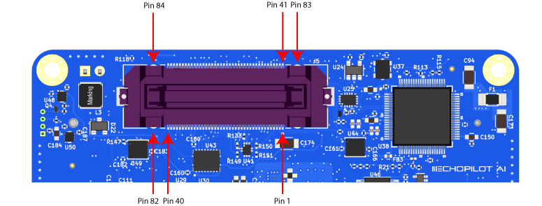
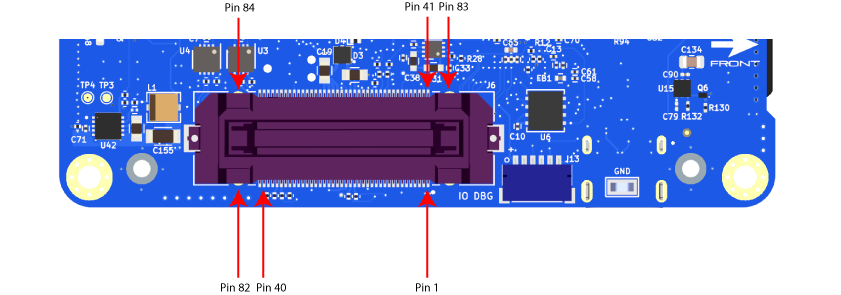

## EchoPilot AI Pinout

### Top Side EchoPilot AI

#### Debug Power In (J8)
This connector is **not normally used**. It exists only to power the EchoPilot AI without a carrier board attached.

Connector: J8, Part Number: NA  
Mating Connector: NA, 2.54mm spacing, 0.8mm holes

Pin Number   | Direction     | Voltage       | Pin Description
------------ | ------------- | ------------  | ------------
PIN 1        | Pwr            | GND           | Ground
PIN 2        | Pwr IN         | +5.2V          | Debug Power

#### FMU Debug (J12)
This connector is **not normally used** by the customer. It is primarily used during board setup to load bootloader firmware on the FMU. It is however possible to use the UART7 lines for other purposes.

Connector: J12, Part Number: SM06B-SRSS-TB(LF)(SN)  
Mating Connector: SHR-06V-S-B

Pin Number   | Direction     | Voltage       | Pin Description
------------ | ------------- | ------------  | ------------
PIN 1        | Pwr OUT           | +3.3V           | 3.3V Power
PIN 2        | O            | +3.3V          | FMU UART7 TX
PIN 3        | I            | +3.3V          | FMU UART7 RX
PIN 4        | IO            | +3.3V         | FMU SWDIO
PIN 5        | O            | +3.3V          | FMU SWCLK
PIN 6        | Pwr           | GND          | Gnd

#### ESP32 (Remote ID) Program/Debug (J11)
This connector is used to flash new firmware to the ESP32 for the RemoteID subsystem.

Connector: J11, Part Number: NA  
Mating Connector/Cable: Tag Connect TC2030-USB-NL

Pin Number   | Direction     | Voltage       | Pin Description
------------ | ------------- | ------------  | ------------
PIN 1        | NA            | NA          | NC
PIN 2        | NA            | NA          | NC
PIN 3        | IO            | Diff Signal          | USB D-
PIN 4        | IO            | Diff Signal          | USB D+
PIN 5        | Pwr            | GND         | Gnd
PIN 6        | NA            | NA         | NC

#### FAN (J38)
This connector is used to connect the fan from active heatsinks from [ConnectTech.com](https://ConnectTech.com)

Connector: J38, Part Number: 0530470410  
Mating Connector: 0510210400

Pin Number   | Direction     | Voltage       | Pin Description
------------ | ------------- | ------------  | ------------
PIN 1        | Pwr            | GND          | Gnd
PIN 2        | Pwr OUT         | +5V          | Fan Power
PIN 3        | I           | +5V          | Fan Tachometer Signal
PIN 4        | O            | +5V         | Fan PWM Signal

#### FMU USB (J7)
This is a USB-C connector following USB 2.0 specifications. It provides access to the autopilot (FMU) via the main STM32H7 processor. Connect to this port for configuration of the autopilot or autopilot firmware updates.

Connector: J7, Part Number: 1054500101  
Mating Connector: USB-C 2.0 compliant cable. 

#### Jetson USB Console (J15)
This is a USB-C connector providing console UART access to the Jetson SOM via an FTDI FT231XQ-R USB to Serial converter.

Connector: J15, Part Number: 1054500101
Mating Connector: USB-C 2.0 compliant cable.

#### FMU SD Card (J10)
MicroSD card for logging from the FMU.

Connector: J10, Part Number: 5025700893
Mating Connector: MicroSD Card

### Bottom Side EchoPilot AI

#### Board to Board Jetson (J5)
This connector handles the Jetson-related board to board signals between the EchoPilot AI and a carrier board.

Connector: J5, Part Number: FX23L-80S-0.5SV  
Mating Connector: FX23L-80P-0.5SV10 (10mm standoff, also available in 8 and 12mm variants, which may be applicable if using a custom carrier board)  

| Pin Number | Direction | Voltage | Pin Desription    |
|------------|-----------|---------|-------------------|
| 1          | IO         | Diff Signal    | Jetson CAN+ |
| 2          | IO         | Diff Signal    | Jetson CAN- |
| 3          | Pwr       | GND     | GND              |
| 4          | IO        | 1.8V    | CAM0_SDA0         |
| 5          | IO           |   1.8V      | CAM0_SCL0          |
| 6          | IO          |   1.8V      | CAM0_MCLK                  |
| 7          | IO          |   1.8V      | CAM0_GPIO                  |
| 8          | Pwr          |   GND      | GND                  |
| 9          |  IO         |   Diff Signal      | CAM0_D1+                  |
| 10         |  IO         |  Diff Signal       | CAM0_D1-                   |
| 11         |  Pwr         |   GND      | GND                  |
| 12         |  IO         |    Diff Signal     |  CAM0_CLK+                 |
| 13         |  IO         |  Diff Signal       | CAM0_CLK-                  |
| 14         |  Pwr         |   GND      | GND                  |
| 15         |  IO         |   Diff Signal      | CAM0_D0+                  |
| 16         |  IO         |   Diff Signal      | CAM0_D0-                  |
| 17         |  Pwr         |   GND      | GND                  |
| 18         | IO        | 1.8V    | CAM1_SDA0         |
| 19         | IO           |   1.8V      | CAM1_SCL0          |
| 20         | IO          |    1.8V     | CAM1_MCLK                  |
| 21         | IO          |    1.8V     | CAM1_GPIO                  |
| 22         | Pwr          |    GND     | GND                  |
| 23         | IO          |   Diff Signal      | CAM1_D1+                  |
| 24         | IO          |  Diff Signal       | CAM1_D1-                   |
| 25         |  Pwr         |    GND     | GND                  |
| 26         |  IO         |    Diff Signal     |  CAM1_CLK+                 |
| 27         |  IO         |   Diff Signal      | CAM1_CLK-                  |
| 28         |  Pwr         |   GND      | GND                  |
| 29         |  IO         |  Diff Signal       | CAM1_D0+                  |
| 30         |  IO         |  Diff Signal       | CAM1_D0-                  |
| 31         |  Pwr         |   GND      | GND                  |
| 32         |  IO         |  Diff Signal       | CAM0_D2+                  |
| 33         |  IO         |  Diff Signal       | CAM0_D2-                  |
| 34         |  Pwr         |   GND      | GND                  |
| 35         |  IO         |  Diff Signal       | CAM0_D3+                  |
| 36         |  IO         |  Diff Signal       | CAM0_D3-                  |
| 37         |  IO         |  1.8V       | I2SO_DIN                  |
| 38         |  IO         |  1.8V       | nMOD_SLEEP                  |
| 39         |  IO         |  1.8V       | SLEEP/WAKE                  |
| 40         |  IO         |  1.8V       | I2SO_FS                 |
| 41         |   IO        |  Diff Signal       |  ETH0 TX-                 |
| 42         |   IO        |   Diff Signal      |  ETH0 TX+                 |
| 43         |   IO        |   Diff Signal      |  ETH0 RX-                 |
| 44         |   IO        |   Diff Signal      |  ETH0 RX+                 |
| 45         |   Pwr        |   GND      |  GND                 |
| 46         |   IO        |   Diff Signal      |  ETH2 RX+                 |
| 47         |   IO        |   Diff Signal      |  ETH2 RX-                 |
| 48         |   IO        |   Diff Signal      |  ETH2 TX+                 |
| 49         |   IO        |   Diff Signal      |  ETH2 TX-                 |
| 50         |    Pwr       |    GND     |  GND                 |
| 51         |    IO       |    Diff Signal     |  JETSON USB3SS RX+                 |
| 52         |    IO       |    Diff Signal     |  JETSON USB3SS RX-                 |
| 53         |   Pwr        |   GND      |  GND                |
| 54         |   IO        |   Diff Signal      |  JETSON USB3SS TX+                 |
| 55         |   IO        |   Diff Signal      |  JETSON USB3SS TX-                 |
| 56         |   Pwr        |   GND      |  GND                 |
| 57         |   Pwr OUT        |   5V      |  USB3SS VBUS                 |
| 58         |    IO       |  Diff Signal       |  JETSON USB3SS D+                 |
| 59         |   IO        |  Diff Signal       |  JETSON USB3SS D-                 |
| 60         |   Pwr        |   GND      |  GND                 |
| 61         |   Pwr OUT       |    5V     |  VBUS3                 |
| 62         |    IO       |   Diff Signal      |  USB_3 D+                 |
| 63         |    IO       |   Diff Signal      |  USB_3 D-                 |
| 64         |    Pwr       |    GND     |  GND                 |
| 65         |    Pwr       |     5V    |  VBUS2                 |
| 66         |    IO       |   Diff Signal      |  USB_2 D+                 |
| 67         |    IO       |   Diff Signal      |  USB_2 D-                 |
| 68         |    Pwr       |   GND      |  GND                 |
| 69         |    Pwr OUT       |   5V      |  VBUS1                 |
| 70         |    IO      |   Diff Signal      |  USB_1 D+            |
| 71         |    IO       |  Diff Signal       |  USB_1 D-                 |
| 72         |    Pwr       |   GND      |  GND                 |
| 73         |    I       |   3.3V      |  IRIDIUM RING                 |
| 74         |    I       |   3.3V      |  IRIDIUM RX UART                 |
| 75         |    I       |   3.3V      |  IRIDIUM TX UART                 |
| 76         |    O       |   3.3V      |   I2S0_SCLK                |
| 77         |   IO        |   1.8      |   JETSON I2C1_SDA               |
| 78         |   O        |   1.8      |   JETSON I2C1_SCL                |
| 79         |   Pwr OUT        |   3.3      |   JETSON GPIO 02                |
| 80         |   Pwr OUT        |   3.3      |   +3.3V OUT                |
| 81         |   Pwr IN        |   5.2      |   +5.2V                |
| 82         |    Pwr IN       |   5.2      |   +5.2V                |
| 83         |  Pwr         |   GND      |    GND               |
| 84         |  Pwr         |   GND      |    GND               |

#### Board to Board FMU (J6)
This connector handles the FMU-related board to board signals between the EchoPilot AI and a carrier board.

Connector: J5, Part Number: FX23L-80S-0.5SV  
Mating Connector: FX23L-80P-0.5SV8 (8mm standoff, also available in 10 and 12mm)  

| Pin Number | Direction | Voltage | Pin Desription    |
|------------|-----------|---------|-------------------|
| 1          | 0         | 3.3V    | FMW PWM CH6 |
| 2          | O         | 3.3V    | FMW PWM CH5 |
| 3          | O       | 3.3V     | FMW PWM CH4              |
| 4          | O        | 3.3V    | FMW PWM CH3        |
| 5          | O           |   3.3V      | FMW PWM CH2          |
| 6          | O          |   3.3V      | FMW PWM CH1                  |
| 7          | O          |   3.3V      | IO PWM CH1                  |
| 8          | O          |   3.3V      | IO PWM CH2                   |
| 9          |  O         |   3.3V      | IO PWM CH3                   |
| 10         |  O         |  3.3V       | IO PWM CH4                    |
| 11         |  O         |   3.3V      | IO PWM CH5                   |
| 12         |  O         |    3.3V     |  IO PWM CH6                 |
| 13         |  O         |  3.3V       | IO PWM CH7                   |
| 14         |  O         |   3.3V      | IO PWM CH8                   |
| 15         |  Pwr         |   GND      | GND                  |
| 16         |  Pwr         |   GND      | GND                  |
| 17         |  Pwr OUT         |   +5V      | +5V OUT  (PROTECTED)                |
| 18         | O        | 3.3V    | FMU I2C_2 SCL         |
| 19         | IO           |   3.3V      |    FMU I2C_2 SDA       |
| 20         | Pwr          |    GND     |    GND               |
| 21         | Pwr OUT         |    +5V     |   +5V OUT (PROTECTED)                |
| 22         | IO          |    Diff Signal     | CAN 2+                   |
| 23         | IO          |   Diff Signal      | CAN 2-                  |
| 24         | Pwr          |  GND       | GND                   |
| 25         |  Pwr OUT         |    +5V     | +5V OUT (PROTECTED)                 |
| 26         |  IO         |    Diff Signal     |  CAN 1+                 |
| 27         |  IO         |   Diff Signal      |  CAN 1-                  |
| 28         |  Pwr         |   GND      | GND                  |
| 29         |  Pwr OUT         |  +5V       | +5V OUT (PROTECTED)                  |
| 30         |  O         |  +3.3V       | TELEM1_RTS                  |
| 31         |  I         |   +3.3V      | TELEM1_CTS                 |
| 32         |  I         |  +3.3V      | TELEM1_RX                |
| 33         |  O         |  +3.3V       | TELEM1_TX                  |
| 34         |  Pwr         |  GND      | GND                  |
| 35         |  I         |  3.3V       | BATTERY CURRENT SENSE                  |
| 36         |  I         |  3.3V       | BATTERY VOLTAGE SENSE                 |
| 36         |  Pwr         |  GND      | GND                  
| 38         |  I          |  +3.3V       | +VSERVO SENSE                  |
| 39         |   Pwr        |  GND       | GND                  |
| 40         |   NA        |   NA      | NC   |
| 41         |   Pwr OUT        |  Pwr       |  +5V OUT (PROTECTED)                 |
| 42         |   O        |   +3.3V      |  SPI5 SCLK                 |
| 43         |   I        |   +3.3V     |  SPI5 MISO                 |
| 44         |   I        |   Diff Signal      |  SPI5_MOSI                |
| 45         |   O        |   +3.3V      |  SPI5 CS1  (PI4)               |
| 46         |   O        |   +3.3V      |  SPI5 CS2 (PI10)                |
| 47         |   Pwr        |   GND      |  GND                 |
| 48         |   Pwr OUT       |   +5V      |  +5V OUT (PROTECTED)                 |
| 49         |   O        |   +3.3V      |  GPS1 TX                 |
| 50         |    I       |    +3.3V     |  GPS1 RX                 |
| 51         |    O       |    3.3V     |  FMU I2C_1 SCL                 |
| 52         |    IO       |    3.3V     |  FMU I2C_1 SDA                 |
| 53         |   Pwr        |   GND      |  GND                |
| 54         |   I        |   +3.3V      |  SAFETY SWITCH IN                 |
| 55         |   O        |   +3.3V      |  SAFETY SWITCH LED OUT                 |
| 56         |   Pwr OUT       |   +3.3V      |  +3.3V OUT (SAFETY)                 |
| 57         |   O        |   +5V      |  BUZZER OUT                 |
| 58         |    Pwr       |  GND       |  GND                |
| 59         |   Pwr OUT        |  +5V       |  +5 VOUT (PROTECTED)                 |
| 60         |   I        |   +3.3V      |  RC INPUT                 |
| 61         |   Pwr        |   GND     |  GND                 |
| 62         |    Pwr IN      |   +5.4V      |  +5.4V IN FMU                 |
| 63         |    Pwr IN       |   +5.4V      |  +5.4V IN FMU                 |
| 64         |    Pwr IN       |    +5.4V     |  +5.4V IN FMU                 |
| 65         |    Pwr IN       |     +5.4V    |  +5.4V IN FMU                 |
| 66         |    Pwr       |   GND      |  GND                |
| 67         |    Pwr       |   GND      |  GND                 |
| 68         |    Pwr       |   GND      |  GND                 |
| 69         |    Pwr        |   GND      |  GND                 |
| 70         |    I      |   +3.3V      |  VDD POWER A VALID            |
| 71         |    I       |  +3.3V       |  VDD POWER B VALID                 |
| 72         |    O       |   +3.3V      |  SBUS OUTPUT                 |
| 73         |    O       |   3.3V      |  FMU UART4 TX                 |
| 74         |    I       |   3.3V      |  FMU UART4 RX                 |
| 75         |    Pwr       |   GND      |  GND                 |
| 76         |    I       |   3.3V      |   BATTERY2 CURRENT SENSE                |
| 77         |   I        |   3.3V      |   BATTERY2 VOLTAGE SENSE              |
| 78         |   I        |   3.3V      |   SPARE ADC1                |
| 79         |   I        |   3.3V     |   SPARE ADC2                |
| 80         |   NA        |   NA      |   NC               |
| 81         |   Pwr IN        |   +5.2V      |   +5.2V (JETSON POWER)     |
| 82         |    Pwr IN        |   +5.2V      |   +5.2V (JETSON POWER)     |
| 83         |  Pwr         |   GND      |    GND               |
| 84         |  Pwr         |   GND      |    GND               |

#### IO Debug (J13)
This connector is **not normally used** by the customer. It is used during board setup to load bootloader firmware on the IOMCU.

Connector: J13, Part Number: SM06B-SRSS-TB(LF)(SN)  
Mating Connector: SHR-06V-S-B

Pin Number   | Direction     | Voltage       | Pin Description
------------ | ------------- | ------------  | ------------
PIN 1        | Pwr Out           | +3.3V           | 3.3V Power
PIN 2        | O            | +3.3V          | IOMCU UART1 TX
PIN 3        | I            | +3.3V          | IOMCU UART1 RX
PIN 4        | IO            | +3.3V         | IOMCU SWDIO
PIN 5        | O            | +3.3V          | IOMCU SWCLK
PIN 6        | Pwr           | GND          | Gnd

#### Jetson Debug (J25)
This connector is used to flash new firmware to the Jetson SOM.

Connector: J25, Part Number: 629105150521 
Mating Connector: MicroUSB Cable

#### NVMe SSD M.2 Slot (J14)
M.2 connector, for use with size 2230 NVMe Solid State Drives. 

Connector: J14, Part Number: MDT420M01001 
Mating Connector: 2230 M.2 Key M