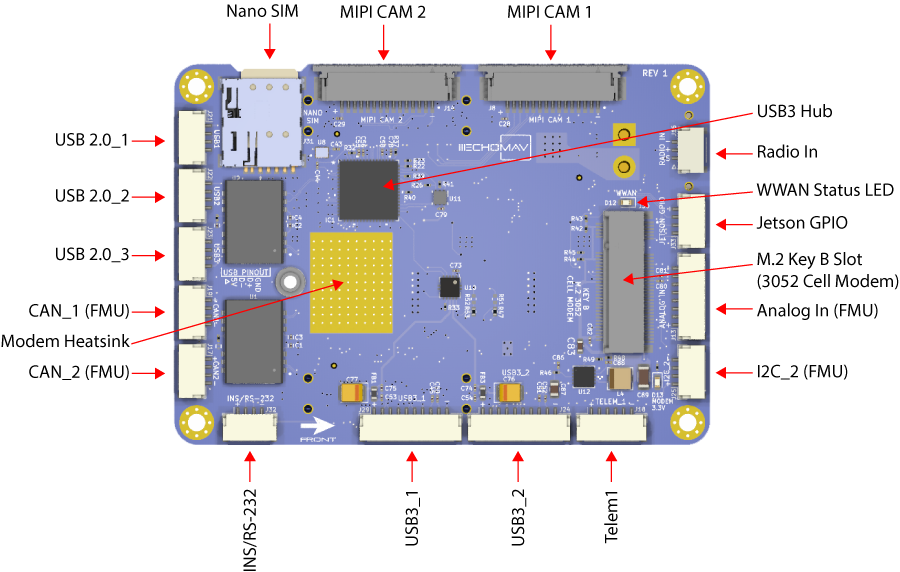

The Carrier Board is open-source, please visit the [echopilot_ai_carrier](https://github.com/EchoMAV/echopilot_ai_carrier) repository. While you may refer to the pinout information below, also feel free to examine the [pdf schematic](https://github.com/EchoMAV/echopilot_ai_carrier/blob/master/echopilot_ai_carrier_schematic.pdf) or the [full design](https://github.com/EchoMAV/echopilot_ai_carrier) in [Kicad 6.0+](https://www.kicad.org/).  

### Carrier Board Schematic

A full schematic of the carrier board is available: [PDF schematic](https://github.com/EchoMAV/echopilot_ai_carrier/blob/master/echopilot_ai_carrier_schematic.pdf) 

### Top Side Carrier Board

#### Iridium Rockblock 9603 (J10)

This connector is for connection to a [Rockblock Iridium 9603 modem](https://www.groundcontrol.com/us/product/rockblock-9603-compact-plug-and-play-satellite-transmitter/). A straight-through cable with Molex 0510211000 connectors may be used. 

Connector: J10, Part Number: 0532617010  
Mating Connector:  0510211000

| Pin Number | Direction | Voltage | Pin Desription    |
|------------|-----------|---------|-------------------|
| 1          | Pwr         | GND    | GND |
| 2          | NA         | NA    | NC |
| 3          | Pwr       | +5V     | +5V              |
| 4          | O        | 3.3V    | Iridium On/Off         |
| 5          | I           |   3.3V      | TX (from modem's perspective)          |
| 6          | I          |   3.3V      | Iridium Ring                 |
| 7          | I          |   3.3V      | Iridium Network Available                 |
| 8          | NA          |   NA      | NC                  |
| 9          |  NA         |   NA      | NC                  |
| 10         |  O         |  3.3V       | RX (from modem's perspective)    

!!! note
    Custom software is required to implement Iridium SBD communications. Pinmux modifications may be required pending how a software implementation leverages the Iridium modem IO.
#### Ethernet 2 (J9)
This connector is used for Ethernet (100 Mbps to the Jetson). This is connected to a KSZ8795CLXIC 4-port ethernet switch onboard the EchoPilot AI.
!!! note
    The magnetics for Ethernet 2 are onboard the Carrier Board.

Connector: J9, Part Number: SM04B-GHS-TB(LF)(SN)  
Mating Connector: GHR-04V-S

Pin Number   | Direction     | Voltage       | Pin Description
------------ | ------------- | ------------  | ------------
1        | IO            | Diff Signal          | Rx+
2        | IO            | Diff Signal          | Rx-
3        | IO            | Diff Signal          | Tx+
4        | IO            | Diff Signal         | Tx-       

#### Ethernet 1 (J15)
This connector is used for Ethernet (100 Mbps to the Jetson). This is connected to a KSZ8795CLXIC 4-port ethernet switch onboard the EchoPilot AI.
!!! note
    The magnetics for Ethernet 1 are onboard the Carrier Board.

Connector: J15, Part Number: SM04B-GHS-TB(LF)(SN)  
Mating Connector: GHR-04V-S

Pin Number   | Direction     | Voltage       | Pin Description
------------ | ------------- | ------------  | ------------
1        | IO            | Diff Signal          | Rx+
2        | IO            | Diff Signal          | Rx-
3        | IO            | Diff Signal          | Tx+
4        | IO            | Diff Signal         | Tx-          |

#### Board to Board Jetson (J5)
This connector handles the Jetson-related board to board signals. It connects to the EchoPilot AI board.  

Connector: J5, Part Number: FX23L-80P-0.5SV8  
Mating Connector: FX23L-80S-0.5SV  

| Pin Number | Direction | Voltage | Pin Desription    |
|------------|-----------|---------|-------------------|
| 1          | I         | 3.3V    | Jetson Console RX |
| 2          | O         | 3.3V    | Jetson Console TX |
| 3          | Pwr       | GND     | GND              |
| 4          | IO        | 1.8V    | CAM0_SDA0         |
| 5          | IO           |   1.8V      | CAM0_SCL0          |
| 6          | IO          |   1.8V      | CAM0_MCLK                  |
| 7          | IO          |   1.8V      | CAM0_GPIO                  |
| 8          | Pwr          |   GND      | GND                  |
| 9          |  IO         |   Diff Signal      | CAM0_D1+                  |
| 10         |  IO         |  Diff Signal       | CAM0_D1-                   |
| 11         |  Pwr         |   GND      | GND                  |
| 12         |  IO         |    Diff Signal     |  CAM0_CLK+                 |
| 13         |  IO         |  Diff Signal       | CAM0_CLK-                  |
| 14         |  Pwr         |   GND      | GND                  |
| 15         |  IO         |   Diff Signal      | CAM0_D0+                  |
| 16         |  IO         |   Diff Signal      | CAM0_D0-                  |
| 17         |  Pwr         |   GND      | GND                  |
| 18         | IO        | 1.8V    | CAM1_SDA0         |
| 19         | IO           |   1.8V      | CAM1_SCL0          |
| 20         | IO          |    1.8V     | CAM1_MCLK                  |
| 21         | IO          |    1.8V     | CAM1_GPIO                  |
| 22         | Pwr          |    GND     | GND                  |
| 23         | IO          |   Diff Signal      | CAM1_D1+                  |
| 24         | IO          |  Diff Signal       | CAM1_D1-                   |
| 25         |  Pwr         |    GND     | GND                  |
| 26         |  IO         |    Diff Signal     |  CAM1_CLK+                 |
| 27         |  IO         |   Diff Signal      | CAM1_CLK-                  |
| 28         |  Pwr         |   GND      | GND                  |
| 29         |  IO         |  Diff Signal       | CAM1_D0+                  |
| 30         |  IO         |  Diff Signal       | CAM1_D0-                  |
| 31         |  Pwr         |   GND      | GND                  |
| 32         |  IO         |  1.8V       | I2S0_DOUT                |
| 33         |  IO         |  1.8V       | I2SO_DIN                  |
| 34         |  IO         |  1.8V       | I2SO_FS                  |
| 35         |  IO         |  1.8V       | I2SO_SCLK                  |
| 36         |  IO         |  1.8V       | AUDIO_MCLK                 |
| 36         |  IO         |  1.8V       | GPIO12                  |
| 38         | IO          |  1.8V       | GPIO10                  |
| 39         |   Pwr        |  GND       | GND                  |
| 40         |   O        |   3.3V      | IRIDIUM RX UART                  |
| 41         |   IO        |  Diff Signal       |  ETH0 TX-                 |
| 42         |   IO        |   Diff Signal      |  ETH0 TX+                 |
| 43         |   IO        |   Diff Signal      |  ETH0 RX-                 |
| 44         |   IO        |   Diff Signal      |  ETH0 RX+                 |
| 45         |   Pwr        |   GND      |  GND                 |
| 46         |   IO        |   Diff Signal      |  ETH2 RX+                 |
| 47         |   IO        |   Diff Signal      |  ETH2 RX-                 |
| 48         |   IO        |   Diff Signal      |  ETH2 TX+                 |
| 49         |   IO        |   Diff Signal      |  ETH2 TX-                 |
| 50         |    Pwr       |    GND     |  GND                 |
| 51         |    IO       |    3.3V     |  JETSON I2C1_SDA                 |
| 52         |    IO       |    3.3V     |  JETSON I2C1_SCL                 |
| 53         |   NA        |   NA      |  NC                |
| 54         |   NA        |   NA      |  NC                 |
| 55         |   NA        |   NA      |  NC                 |
| 56         |   Pwr        |   GND      |  GND                 |
| 57         |   Pwr        |   5V      |  VBUS5                 |
| 58         |    IO       |  Diff Signal       |  USB5 D+                 |
| 59         |   IO        |  Diff Signal       |  USB5 D-                 |
| 60         |   Pwr        |   GND      |  GND                 |
| 61         |   Pwr        |    5V     |  VBUS4                 |
| 62         |    IO       |   Diff Signal      |  USB4 D+                 |
| 63         |    IO       |   Diff Signal      |  USB4 D-                 |
| 64         |    Pwr       |    GND     |  GND                 |
| 65         |    Pwr       |     5V    |  VBUS3                 |
| 66         |    IO       |   Diff Signal      |  USB3 D+                 |
| 67         |    IO       |   Diff Signal      |  USB3 D-                 |
| 68         |    Pwr       |   GND      |  GND                 |
| 69         |    Pwr OUT       |   5V      |  VBUS2                 |
| 70         |    IO      |   Diff Signal      |  USB2 D+            |
| 71         |    IO       |  Diff Signal       |  USB2 D-                 |
| 72         |    Pwr       |   GND      |  GND                 |
| 73         |    I       |   3.3V      |  IRIDIUM NA                 |
| 74         |    I       |   3.3V      |  IRIDIUM RING                 |
| 75         |    I       |   3.3V      |  IRIDIUM TX UART                 |
| 76         |    O       |   3.3V      |   IRIDIUM ON/OFF                |
| 77         |   Pwr OUT        |   1.8      |   +1.8V OUT               |
| 78         |Pwr OUT        |   1.8      |   +1.8V OUT                |
| 79         |   Pwr OUT        |   3.3      |   +3.3V OUT                |
| 80         |   Pwr OUT        |   3.3      |   +3.3V OUT                |
| 81         |   Pwr IN        |   5.1      |   +5.1V                |
| 82         |    Pwr IN       |   5.1      |   +5.1V                |
| 83         |  Pwr         |   GND      |    GND               |
| 84         |  Pwr         |   GND      |    GND               |

#### PWM Output from FMU (J28)
This connector provides the PWM outputs from the FMU. The EchoPilot AI's autopilot hardware consist of a main processor (FMU) and an IO processor. The IO processor provides 8 PWM outputs (labeled IO CHX below) and the FMU provides 4 PWM outputs. An important distinction between the two is that **only the FMU outputs are D-Shot compatible**.  

The +VServo Sense input is optional and is used by the FMU to detect a drop in the VServo rail. This is an input only, the Carrier board does **not** provide power to the servo voltage rail. 

> The EchoPilot AI comes with a PWM Breakout board which allows users to use standard Futaba-style (3 pin, 0.1" spacing) servo connectors. The PWM Breakout Board is plugged into this connector with the supplied cable. 

Connector: J28, Part Number: SM14B-GHS-TB(LF)(SN)  
Mating Connector: GHR-14V-S

Pin Number   | Direction     | Voltage       | Pin Description
------------ | ------------- | ------------  | ------------
1        | O            | +3.3          | IO CH1
2        | O            | +3.3         | IO CH2
3        | O            | +3.3          | IO CH3
4        | O            | +3.3         | IO CH4      
5        | O            | +3.3          | IO CH5
6        | O            | +3.3          | IO CH6
7        | O            | +3.3          | IO CH7
8        | O            | +3.3         | IO CH8   
9        | O            | +3.3          | FMU CH1
10        | O            |+3.3          | FMU CH2
11       | O            | +3.3          | FMU CH3
12        | O            | +3.3        | FMU CH4   
13        | I            | +5V          | +VServo Sense (Optional)
14        | Pwr            | GND              | GND

#### Board to Board FMU (J6)
This connector handles the FMU-related board to board signals.  It connects to the EchoPilot AI board.  

Connector: J6, Part Number: FX23L-80P-0.5SV8  
Mating Connector: FX23L-80S-0.5SV   

| Pin Number | Direction | Voltage | Pin Desription    |
|------------|-----------|---------|-------------------|
| 1          | 0         | 3.3V    | FMU PWM CH6 |
| 2          | O         | 3.3V    | FMU PWM CH5 |
| 3          | O       | 3.3V     | FMU PWM CH4              |
| 4          | O        | 3.3V    | FMU PWM CH3        |
| 5          | O           |   3.3V      | FMU PWM CH2          |
| 6          | O          |   3.3V      | FMU PWM CH1                  |
| 7          | O          |   3.3V      | IO PWM CH1                  |
| 8          | O          |   3.3V      | IO PWM CH2                   |
| 9          |  O         |   3.3V      | IO PWM CH3                   |
| 10         |  O         |  3.3V       | IO PWM CH4                    |
| 11         |  O         |   3.3V      | IO PWM CH5                   |
| 12         |  O         |    3.3V     |  IO PWM CH6                 |
| 13         |  O         |  3.3V       | IO PWM CH7                   |
| 14         |  O         |   3.3V      | IO PWM CH8                   |
| 15         |  Pwr         |   GND      | GND                  |
| 16         |  Pwr         |   GND      | GND                  |
| 17         |  Pwr OUT         |   +5V      | +5V OUT  (PROTECTED)                |
| 18         | O        | 3.3V    | FMU I2C_2 SCL         |
| 19         | IO           |   3.3V      |    FMU I2C_2 SDA       |
| 20         | Pwr          |    GND     |    GND               |
| 21         | Pwr OUT         |    +5V     |   +5V OUT (PROTECTED)                |
| 22         | IO          |    Diff Signal     | CAN 2+                   |
| 23         | IO          |   Diff Signal      | CAN 2-                  |
| 24         | Pwr          |  GND       | GND                   |
| 25         |  Pwr OUT         |    +5V     | +5V OUT (PROTECTED)                 |
| 26         |  IO         |    Diff Signal     |  CAN 1+                 |
| 27         |  IO         |   Diff Signal      |  CAN 1-                  |
| 28         |  Pwr         |   GND      | GND                  |
| 29         |  Pwr OUT         |  +5V       | +5V OUT (PROTECTED)                  |
| 30         |  O         |  +3.3V       | TELEM1_RTS                  |
| 31         |  I         |   +3.3V      | TELEM1_CTS                 |
| 32         |  I         |  +3.3V      | TELEM1_RX                |
| 33         |  O         |  +3.3V       | TELEM1_TX                  |
| 34         |  Pwr         |  GND      | GND                  |
| 35         |  I         |  3.3V       | BATTERY CURRENT SENSE                  |
| 36         |  I         |  3.3V       | BATTERY VOLTAGE SENSE                 |
| 36         |  Pwr         |  GND      | GND                  
| 38         |  I          |  +3.3V       | +VSERVO SENSE                  |
| 39         |   Pwr        |  GND       | GND                  |
| 40         |   NA        |   NA      | NC   |
| 41         |   Pwr OUT        |  Pwr       |  +5V OUT (PROTECTED)                 |
| 42         |   O        |   +3.3V      |  SPI5 SCLK                 |
| 43         |   I        |   +3.3V     |  SPI5 MISO                 |
| 44         |   I        |   Diff Signal      |  SPI5_MOSI                |
| 45         |   O        |   +3.3V      |  SPI5 CS1  (PI4)               |
| 46         |   O        |   +3.3V      |  SPI5 CS2 (PI10)                |
| 47         |   Pwr        |   GND      |  GND                 |
| 48         |   Pwr OUT       |   +5V      |  +5V OUT (PROTECTED)                 |
| 49         |   O        |   +3.3V      |  GPS1 TX                 |
| 50         |    I       |    +3.3V     |  GPS1 RX                 |
| 51         |    O       |    3.3V     |  FMU I2C_1 SCL                 |
| 52         |    IO       |    3.3V     |  FMU I2C_1 SDA                 |
| 53         |   Pwr        |   GND      |  GND                |
| 54         |   I        |   +3.3V      |  SAFETY SWITCH IN                 |
| 55         |   O        |   +3.3V      |  SAFETY SWITCH LED OUT                 |
| 56         |   Pwr OUT       |   +3.3V      |  +3.3V OUT (SAFETY)                 |
| 57         |   O        |   +5V      |  BUZZER OUT                 |
| 58         |    Pwr       |  GND       |  GND                |
| 59         |   Pwr OUT        |  +5V       |  +5 VOUT (PROTECTED)                 |
| 60         |   I        |   +3.3V      |  RC INPUT                 |
| 61         |   Pwr        |   GND     |  GND                 |
| 62         |    Pwr IN      |   +5.4V      |  +5.4V IN FMU                 |
| 63         |    Pwr IN       |   +5.4V      |  +5.4V IN FMU                 |
| 64         |    Pwr IN       |    +5.4V     |  +5.4V IN FMU                 |
| 65         |    Pwr IN       |     +5.4V    |  +5.4V IN FMU                 |
| 66         |    Pwr       |   GND      |  GND                |
| 67         |    Pwr       |   GND      |  GND                 |
| 68         |    Pwr       |   GND      |  GND                 |
| 69         |    Pwr        |   GND      |  GND                 |
| 70         |    I      |   +3.3V      |  VDD POWER A VALID            |
| 71         |    I       |  +3.3V       |  VDD POWER B VALID                 |
| 72         |    O       |   +3.3V      |  SBUS OUTPUT                 |
| 73         |    O       |   3.3V      |  FMU UART4 TX                 |
| 74         |    I       |   3.3V      |  FMU UART4 RX                 |
| 75         |    Pwr       |   GND      |  GND                 |
| 76         |    NA       |   NA      |   NC                |
| 77         |   NA        |   NA      |   NC              |
| 78         |   NA        |   NA      |   NC                |
| 79         |   NA        |   NA     |   NC                |
| 80         |   NA        |   NA      |   NC               |
| 81         |   Pwr IN        |   +5.1V      |   +5.1V (JETSON POWER)     |
| 82         |    Pwr IN        |   +5.1V      |   +5.1V (JETSON POWER)     |
| 83         |  Pwr         |   GND      |    GND               |
| 84         |  Pwr         |   GND      |    GND               |

#### +5V Out (J11)
This connector provides a spare regulated +5V output. It is protected by a reverse polarity diode and a self-resetting fuse (060#L100SLYR)  

Connector: J11, Part Number: SM02B-GHS-TB(LF)(SN)  
Mating Connector: GHR-02V-S   

Pin Number   | Direction     | Voltage       | Pin Description
------------ | ------------- | ------------  | ------------
1        | Pwr            | +5V          | +5V Out
2        | Pwr            | GND         | GND

#### +VBattery (J12)
This connector provides a spare raw battery voltage output (what is input to J27, XT30 power in). It is protected by a reverse polarity diode.

Connector: J12, Part Number: SM02B-GHS-TB(LF)(SN)  
Mating Connector: GHR-02V-S   

Pin Number   | Direction     | Voltage       | Pin Description
------------ | ------------- | ------------  | ------------
1        | Pwr            | +VBATT          | +VBATT Out
2        | Pwr            | +VBATT         | +VBATT Out
3        | Pwr            | GND          | GND
4        | Pwr            | GND         | GND

#### GPS/Compass (J20)
This connector provides a [Pixhawk standard](https://github.com/pixhawk/Pixhawk-Standards/blob/master/DS-009%20Pixhawk%20Connector%20Standard.pdf) GPS/Compass connection.

Connector: J20, Part Number: SM10B-GHS-TB(LF)(SN)  
Mating Connector: GHR-10V-S   

Pin Number   | Direction     | Voltage       | Pin Description
------------ | ------------- | ------------  | ------------
1        | Pwr            | +5V          | +5V Out (Protected)
2        | O            | +3.3V         | GPS TX
3        | I            | +3.3V          | GPS Rx
4        | O            | +3.3V         | I2C 1 SCL
5        | IO            | +3.3V          | I2C 1 SDA
6        | I            | +3.3V         | Safety Switch In
7        | O            | +3.3V          | Safety Switch LED Out
8        | Pwr            | +3.3V         | Safey VDD 3.3V
9        | Pwr            | +5V          | Buzzer Out
10        | Pwr            | GND         | GND

#### Radio In (J16)
This connector provides a optional radio input in to the autopilot. A wide range of radio protocols are supported. Please see [here](https://ardupilot.org/copter/docs/common-rc-systems.html) for example.

Connector: J16, Part Number: SM03B-GHS-TB(LF)(SN)   
Mating Connector: GHR-03V-S   

Pin Number   | Direction     | Voltage       | Pin Description
------------ | ------------- | ------------  | ------------
1        | Pwr            | +3.3V          | RC In
2        | I            | +5V         | +5V Out (Protected)
3        | Pwr            | GND         | GND

#### Power In (J27)
This connector provides power input to the system. The power supply should be between 7-56 VDC and should be capable of supply up to 4A.

Connector: J27, Part Number: XT30PW-M  
Mating Connector: XT30U-F  

Pin Number   | Direction     | Voltage       | Pin Description
------------ | ------------- | ------------  | ------------
1        | Pwr            | GND          | GND
2        | Pwr            | +7-56VDC         | +V Input

### Bottom Side Carrier Board

#### MIPI Cam 2 (J14)
This connector provides a CSI/MIPI Camera connection, following the Raspberry Pi 15-pin 1mm spacing FFC standard.

Connector: J14, Part Number: 1-84952-5
Mating Connector: FFC Cable, 15 pos, 1mm pin spacing   

Pin Number   | Direction     | Voltage       | Pin Description
------------ | ------------- | ------------  | ------------
1        | Pwr            | GND          | GND
2        | IO            | Diff Signal        | CAM1_D0-
3        | IO            | Diff Signal          | CAM1_D0+
4        | Pwr            | GND         | GND
5        | IO            | Diff Signal          | CAM1_D1-
6        | IO            | Diff Signal         | CAM1_D1+
7        | Pwr            | GND          | GND
8        | O            | Diff Signal         | CAM1_CLK-
9        | O            | Diff Signal          | CAM1_CLK+
10        | Pwr            | GND         | GND
11        | IO            | +3.3V          | CAM1_GPIO
12       | O            | +3.3V         | CAM1_MCLK
13        | O            | +3.3V          | CAM1_SCL0
14        | IO            | +3.3V         | CAM1_SDAO
15        | Pwr            | +3.3V          | +3.3V

#### MIPI Cam 1 (J8)
This connector provides a CSI/MIPI Camera connection, following the Raspberry Pi 15-pin 1mm spacing FFC standard.

Connector: J8, Part Number: 1-84952-5
Mating Connector: FFC Cable, 15 pos, 1mm pin spacing   

Pin Number   | Direction     | Voltage       | Pin Description
------------ | ------------- | ------------  | ------------
1        | Pwr            | GND          | GND
2        | IO            | Diff Signal        | CAM0_D0-
3        | IO            | Diff Signal          | CAM0_D0+
4        | Pwr            | GND         | GND
5        | IO            | Diff Signal          | CAM0_D1-
6        | IO            | Diff Signal         | CAM0_D1+
7        | Pwr            | GND          | GND
8        | O            | Diff Signal         | CAM0_CLK-
9        | O            | Diff Signal          | CAM0_CLK+
10        | Pwr            | GND         | GND
11        | IO            | +3.3V          | CAM0_GPIO
12       | O            | +3.3V         | CAM0_MCLK
13        | O            | +3.3V          | CAM0_SCL0
14        | IO            | +3.3V         | CAM0_SDAO
15        | Pwr            | +3.3V          | +3.3V

#### Jetson Console (J7)
This is a USB-C connector following USB 2.0 specifications. An FTDI USB to UART IC ((FT231XQ-R) is used to provide UART access to the Jetson. The FTDI chip is powered by the USB bus.

Connector: J7, Part Number: 12401610E4#2A  
Mating Connector: Standard USB-C cable. Does not need to be USB 3 compliant.

#### CAN 2 (FMU) (J17)
This connector provides a [Pixhawk standard](https://github.com/pixhawk/Pixhawk-Standards/blob/master/DS-009%20Pixhawk%20Connector%20Standard.pdf) CAN connection from the FMU (CAN 2).

Connector: J7, Part Number: SM04B-GHS-TB(LF)(SN)  
Mating Connector: GHR-04V-S     

Pin Number   | Direction     | Voltage       | Pin Description
------------ | ------------- | ------------  | ------------
1        | Pwr            | +5V          | +5V Out (Protected)
2        | IO            | Diff Signal        | CAN_2+ (FMU)
3        | IO            | Diff Signal          | CAN_2- (FMU)
4        | Pwr            | GND         | GND

#### Telem1 (J18)
This connector provides a [Pixhawk standard](https://github.com/pixhawk/Pixhawk-Standards/blob/master/DS-009%20Pixhawk%20Connector%20Standard.pdf) TELEM connection from the FMU (TELEM1).

Connector: J18, Part Number: SM06B-GHS-TB(LF)(SN)  
Mating Connector: GHR-06V-S     

Pin Number   | Direction     | Voltage       | Pin Description
------------ | ------------- | ------------  | ------------
1        | Pwr            | +5V          | +5V Out (Protected)
2        | O            | +3.3V        | Telem1 TX
3        | I            | +3.3V          | Telem1 RX
4        | O            | +3.3V        | Telem1 CTS
5        | I            | +3.3V          | Telem1 RTS
6        | Pwr            | GND         | GND

#### I2C 2 (FMU) (J25)
This connector provides a [Pixhawk standard](https://github.com/pixhawk/Pixhawk-Standards/blob/master/DS-009%20Pixhawk%20Connector%20Standard.pdf) I2C connection from the FMU (I2C 2).

Connector: J25, Part Number: SM04B-GHS-TB(LF)(SN)  
Mating Connector: GHR-04V-S     

Pin Number   | Direction     | Voltage       | Pin Description
------------ | ------------- | ------------  | ------------
1        | Pwr            | +5V          | +5V Out (Protected)
2        | O            | +3.3V        | I2C_2 SCL (FMU)
3        | IO            | +3.3V          | I2C_2 SDA (FMU)
4        | Pwr            | GND         | GND

#### V/I Sense (J13)
This connector provides voltage and current sense input, for use with an off-board current sensor monitor. These signals should be scaled to 0-3.3V or damage may occur. Your autopilot firmware will allow you to enter scaling factors for proper display of voltage/current on a GCS system. 

Connector: J13, Part Number: SM03B-GHS-TB(LF)(SN)  
Mating Connector: GHR-03V-S     

Pin Number   | Direction     | Voltage       | Pin Description
------------ | ------------- | ------------  | ------------
1        | I            | +3.3V          | Voltage Sense
2        | I            | +3.3V        | Current Sense
3        | Pwr            | GND         | GND

#### CAN 1 (FMU) (J19)
This connector provides a [Pixhawk standard](https://github.com/pixhawk/Pixhawk-Standards/blob/master/DS-009%20Pixhawk%20Connector%20Standard.pdf) CAN connection from the FMU (CAN 1).

Connector: J19, Part Number: SM04B-GHS-TB(LF)(SN)  
Mating Connector: GHR-04V-S     

Pin Number   | Direction     | Voltage       | Pin Description
------------ | ------------- | ------------  | ------------
1        | Pwr            | +5V          | +5V Out (Protected)
2        | IO            | Diff Signal        | CAN_1+ (Jetson)
3        | IO            | Diff Signal          | CAN_1- (Jetson)
4        | Pwr            | GND         | GND

#### USB4 (J24)
This connector provides USB 2.0 connectivity from the Jetson SOM.

Connector: J24, Part Number: SM04B-GHS-TB(LF)(SN)  
Mating Connector: GHR-04V-S     

Pin Number   | Direction     | Voltage       | Pin Description
------------ | ------------- | ------------  | ------------
1        | Pwr            | +5V          | +5V VBUS (Protected)
2        | IO            | Diff Signal        | USB4_D- (Jetson)
3        | IO            | Diff Signal          | USB4_D+ (Jetson)
4        | Pwr            | GND         | GND

#### USB3 (J23)
This connector provides USB 2.0 connectivity from the Jetson SOM.

Connector: J23, Part Number: SM04B-GHS-TB(LF)(SN)  
Mating Connector: GHR-04V-S     

Pin Number   | Direction     | Voltage       | Pin Description
------------ | ------------- | ------------  | ------------
1        | Pwr            | +5V          | +5V VBUS (Protected)
2        | IO            | Diff Signal        | USB3_D- (Jetson)
3        | IO            | Diff Signal          | USB3_D+ (Jetson)
4        | Pwr            | GND         | GND

#### USB2 (J22)
This connector provides USB 2.0 connectivity from the Jetson SOM.

Connector: J22, Part Number: SM04B-GHS-TB(LF)(SN)  
Mating Connector: GHR-04V-S     

Pin Number   | Direction     | Voltage       | Pin Description
------------ | ------------- | ------------  | ------------
1        | Pwr            | +5V          | +5V VBUS (Protected)
2        | IO            | Diff Signal        | USB2_D- (Jetson)
3        | IO            | Diff Signal          | USB2_D+ (Jetson)
4        | Pwr            | GND         | GND

#### USB1 (J21)
This connector provides USB 2.0 connectivity from the Jetson SOM.

Connector: J21, Part Number: SM04B-GHS-TB(LF)(SN)  
Mating Connector: GHR-04V-S     

Pin Number   | Direction     | Voltage       | Pin Description
------------ | ------------- | ------------  | ------------
1        | Pwr            | +5V          | +5V VBUS (Protected)
2        | IO            | Diff Signal        | USB1_D- (Jetson)
3        | IO            | Diff Signal          | USB1_D+ (Jetson)
4        | Pwr            | GND         | GND

#### Jetson Console (J29)
This is a USB-C connector following USB 2.0 specifications. An FTDI USB to UART IC (FT231XQ-R) is used to provide UART access to the optional VectorNav INS. The FTDI chip is powered by the USB bus.

Connector: J29, Part Number: 12401610E4#2A  
Mating Connector: Standard USB-C cable. Does not need to be USB 3 compliant.