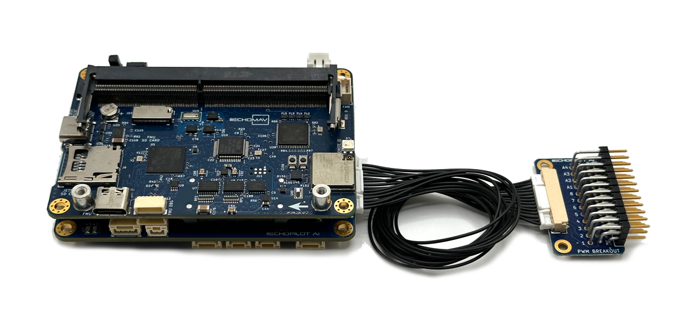
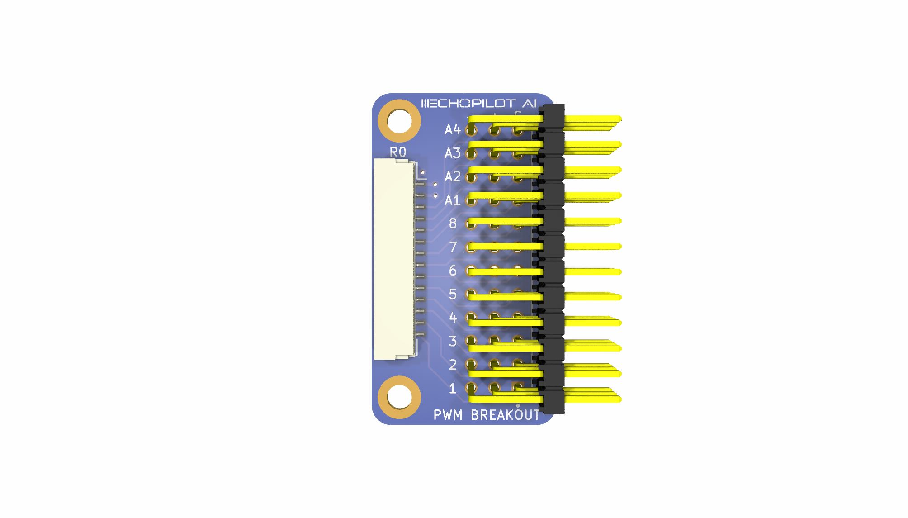
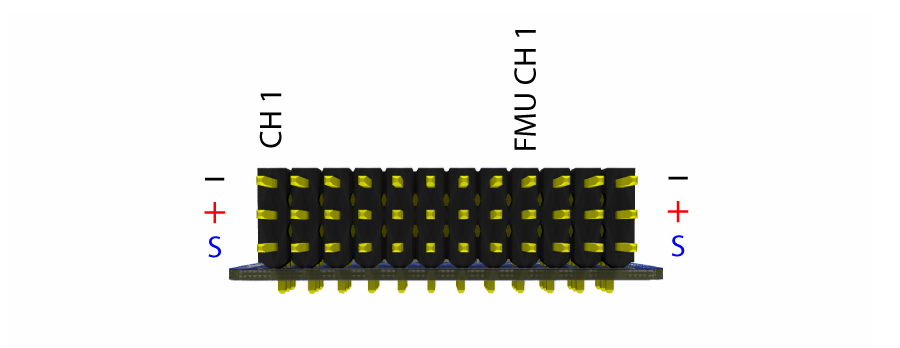

## EchoPilot PWM Breakout Board Pinout

#### JST to EchoPilot Connector
This connector is used along with the provided cable to connect to J20 on the Carrier Board.

Connector: J1, Part Number: SM14B-SRSS-TB(LF)(SN)  
Mating Connector: SHR-14V-S-B

Pin Number   | Direction     | Voltage       | Pin Description
------------ | ------------- | ------------  | ------------
PIN 1        | Pwr            | GND          | GND
PIN 2        | Pwr            | +5V          | +VServo Sense
PIN 3        | O            | +3.3V          | FMU PWM CH4
PIN 4        | O            | +3.3V         | FMU PWM CH3
PIN 5        | O            | +3.3V          | FMU PWM CH2
PIN 6        | O           | +3.3V          | FMU PWM CH1
PIN 7        | O            | +3.3V           | IO PWM CH8
PIN 8        | O            | +3.3V          | IO PWM CH7
PIN 9         | O            | +3.3V          | IO PWM CH6
PIN 10        | O            | +3.3V         | IO PWM CH5
PIN 11        | O            | +3.3V          | IO PWM CH4
PIN 12        | O           | +3.3V          | IO PWM CH3
PIN 13        | O            | +3.3V           | IO PWM CH2
PIN 14        | O            | +3.3V          | IO PWM CH1

#### Header PWM Outputs
This header is used to connect to Futaba-style servo connectors. The PWM outputs are broken up into two groups. To understand why, consider that the autopilot (Flight Management Unit) is based on two separate ICs, a primary controller (often referred to as "the" FMU) and an IO controller (IOMCU). The IOMCU provides the PWM output to CH1 - CH8, which the FMU directly handles CH 9 - CH 12. In Pixhawk designs, the IOMCU outputs are historically (confusingly?) labeled "MAIN." The outputs directly from the FMU are historically named "AUX." At this point you might be asking yourself "why all this confusion." There are two reasons the EchoPilot uses an IOMCU (many autopilots do not) 1. It allows us to support up to 14 PWM outputs and 2. It provides a level of safety and redundancy because the IOMCU can allow core functionality (RC Control) even if the primary FMU fails or crashes. 

One important consideration between "MAIN" and "AUX" outputs are if you are using DShot if your system. DShot outputs are only supported by the FMU, therefore on the EchoPilot AI only "AUX" outputs support DShot. With the stock Carrier board and PWM breakout board, 4 "AUX" outputs are available.

!!! warning

    The middle ("+") pin is bussed together, allowing you to distribute your +VServo voltage. The EchoPilot AI does **NOT** provide +VServo voltage, this must be supplied by an external regulator, BEC, etc. Typically +VServo is provided by an Electronic Speed Controller (ESC) in the system.

Connector: J2, Part Number: TSW-112-08-G-T-RA_1  
Mating Connector: Standard 0.1" spacing servo/esc Futaba style

