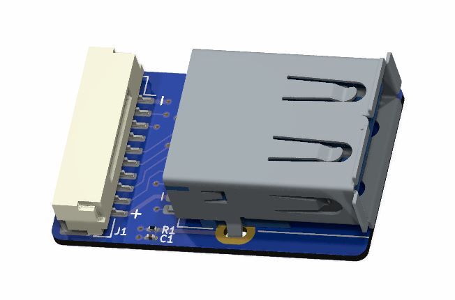

## EchoPilot USB3 SuperSpeed Breakout Board Pinout

#### EchoPilot Carrier Board Connector (J1)
This connector is used along with the provided cable to connect to J24 or J29 on the Carrier Board. It provides standard USB-A SuperSpeed connectivity to peripherals.

Connector: J1, Part Number: SM10B-SRSS-TB(LF)(SN)  
Mating Connector: SHR-10V-S-B

Pin Number   | Direction     | Voltage       | Pin Description
------------ | ------------- | ------------  | ------------
PIN 1        | Pwr            | GND          | GND
PIN 2        | Pwr            | +5V          | USBSS Tx+
PIN 3        | O            | +3.3V          | USBSS Tx-
PIN 4        | O            | +3.3V         | GND
PIN 5        | O            | +3.3V          | USBSS Rx+
PIN 6        | O           | +3.3V          | USBSS Rx-
PIN 7        | O            | +3.3V           | GND
PIN 8        | O            | +3.3V          | USB D+
PIN 9         | O            | +3.3V          | USB D-
PIN 10        | O            | +3.3V         | Vbus

#### USB-A Connector
USB-A SuperSpeed downstream devices are supported with a current draw of up to 1.0A. Supports USB 3.1 SuperSpeed Devices. The standard carrier board utilizes a TUSB8042 hub. Note that 1uF capacitors are placed on the Tx+ and Tx- lines on the carrier board near the connector.

#### STEP File Download

[EchoPilot AI USB3 A Breakout Board 3D model (STEP) File Download](https://echomav.com/mechanical/echopilot-ai-usb-a-breakout.step) (right click, save link as)