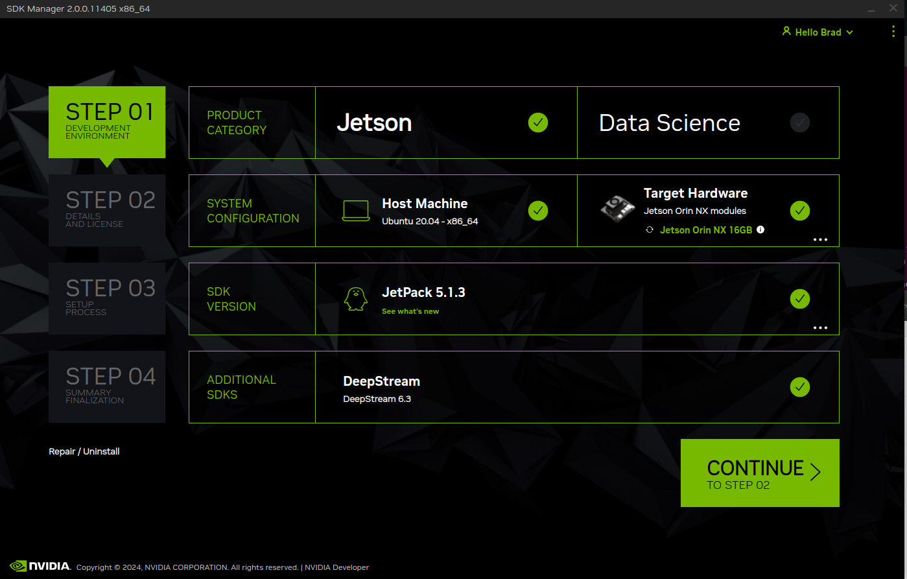
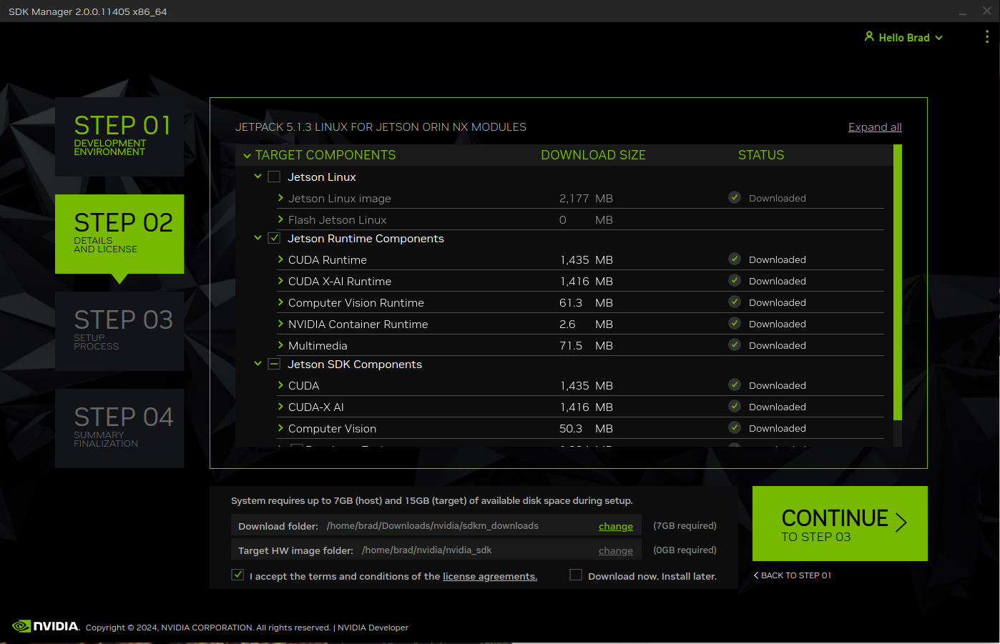
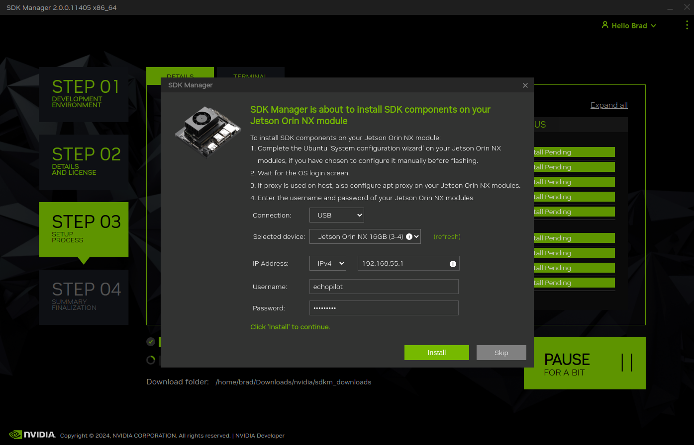

# Installing DeepStream and CUDA for the Jetson

NVIDIA® DeepStream Software Development Kit (SDK) is an accelerated AI framework to build intelligent video analytics (IVA) pipelines. DeepStream runs on NVIDIA® Jetson NX™, NVIDIA® Jetson Orin™ NX, NVIDIA® Jetson Orin™ Nano in conjunction with the EchoPilot AI. 

The CUDA Toolkit provides a development environment for creating high-performance GPU-accelerated applications.

The instructions below show how to install both. These instructions were developed using a Jetson Orin NX with a 256 GB SSD, running L4T 35.4.1. In most cases, you will not be able to install this software without significant available storage space. E.g., an Xavier NX with only a 16 GB eMMC will not have enough storage space. We recommend [adding a NVMe SSD](echopilot_ai.md/#using-an-nvme-ssd) before proceeding. 
!!! note
    The instructions below assume that the EchoPilot AI has internet access. Since EchoPilotAI Jetson hardware is provided with a static IP address, it is often simpler to enable DHCP and let the Jetson get internet through your LAN's router. To do this, you can use the nmcli commands to change the static-eth0 connection profile to auto/hdcp.
    ```
    sudo nmcli con mod static-eth0 ipv4.method auto
    sudo nmcli con down static-eth0
    sudo nmcli con up static-eth0
    ```
    When you are done and would like to return the IP config to static, use:
    ```
    sudo nmcli con mod static-eth0 ipv4.addresses "10.223.44.55/16"   # For example
    sudo nmcli con down static-eth0
    sudo nmcli con up static-eth0
    ```
    Remember if you change the network during a ssh session, you will lose connection. It is recommendced to make network system changes when on a [USB Console](echopilot_ai.md/#accessing-the-jetson-via-the-console) connection. 

## Install NVidia's SDK Manager UI 

Install Nvidia's [SDK Manager](https://developer.nvidia.com/sdk-manager) software.

## Prepare the EchoPilot AI

1. Ensure the EchoPilot AI has internet access, by using the included JST to RJ45 adapter to plug into a network with a router/gateway which provides internet. Refer to the instructions above if you need to configure the Jetson to obtain an IP address via DHCP.
2. Connect a USBA to USB Micro-B connector between the EchoPilotAI (J25) and your host computer.

## Install Software

Using Nvidia's SDK Manager, ensure that you have the appropriate SDK Version selected, and check the box for "Deepstream" for Additional SDKs, then click __Continue__.



1. Select the SDK Components you wish to install.  
2. __Deselect__ "Jetson Linux", as that is already installed. If you reinstall Jetson Linux during this step your EchoPilot AI may no longer work because the custom device tree files will be overwritten.  
3. Click Continue  

!!! WARNING
    __Deselect__ "Jetson Linux" as shown in the screenshot below!

    

1. Select USB as the connection, and enter the username and password (default is echopilot/echopilot). Then click __Install__.
2. This process may take 20-30 minutes depending on which packages are selected.

   

## Verify functionality

At this point, log into the Jetson using either USB Console or SSH and test that the `deepstream-app` runs without errors:
```
deepstream-app --help
```
## Explore Sample Code

Browse and run precompiled sample applications in `sources/apps/sample_apps`.  
Follow the directory’s README file to run the application.